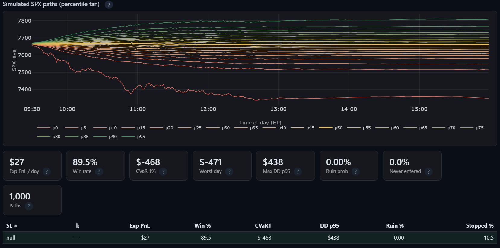
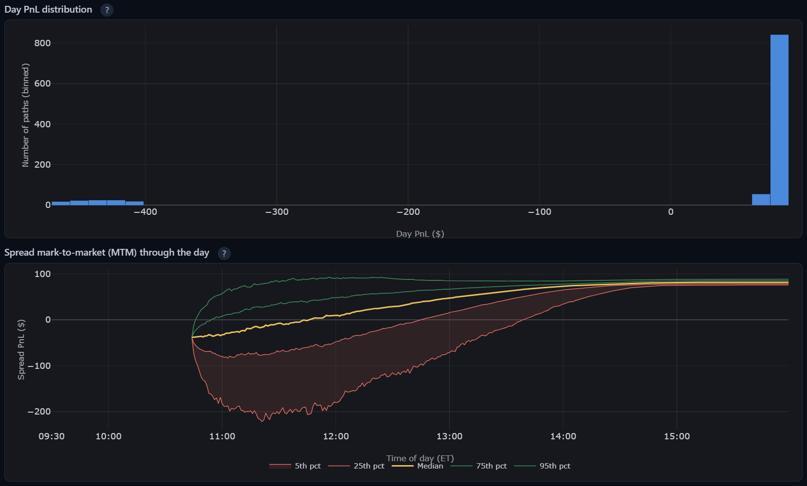
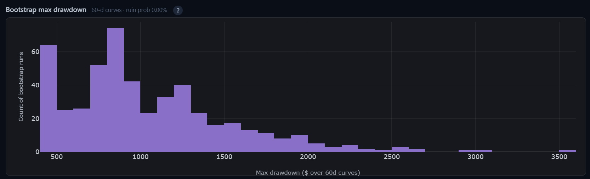

# SPX 0DTE Option Dashboard

A real-time Gamma Exposure (GEX) dashboard for SPX 0DTE options, powered by Interactive Brokers TWS and served as a browser app.

## Stack

| Layer | Technology |
|---|---|
| Broker API | native `ibapi` → IB TWS/Gateway (port 7497) |
| Backend | Python 3.10, FastAPI, uvicorn |
| Real-time push | WebSocket broadcast |
| Frontend | Vanilla JS + Plotly 2.32 |

## Features

- **GEX dashboard with 0DTE / Monthly toggle** — switch the GEX calculation between the current 0DTE SPXW expiry and the monthly SPX expiry.
- **Real-time option chain streaming** — live 0DTE chain with greeks, wall/flip markers, and a strike filter.
- **Account / Order Management tab** — account summary, portfolio positions, and order placement with **Stop Limit** support (also accessible as an order-entry widget on the dashboard).
- **Strategies tab** — define automated multi-leg strategies and let the server watch the market for you:
  - Conditions (entry window, short delta, spread width, credit, trend, volatility), triggers, and a candidate scanner.
  - **Budget-based position sizing** with total-credit preview per candidate.
  - Live candidates ranked best-first, each with a one-click **Place** button.
  - **Take-profit** (idempotent close loop, per-leg limit prices) and **stop-loss** as a single credit multiplier.
  - One-shot eval loop with re-entry guards, margin checks, and a kill switch.
  - **Subsequent strategies** — trigger children off a parent trade's state (parent close / time window), with acyclic tree validation.
- **Simulation tab** — intraday Monte Carlo stress-testing for 0DTE strategies: GJR-GARCH + Student-t paths with U-shape volatility, BSM smile marking, tick-rule fills, family re-entry, SL/strike sweeps and stress dials (ν, γ, λ, ATM-IV anchor), PnL/CVaR/max-DD/ruin analytics.
- **Logging tab** — server-side framework log streamed to the browser.

## Quick Start

1. **Install the Interactive Brokers TWS API.** The native broker client (`ibapi`) is
   not on PyPI — it ships with the TWS API distribution. Download and install it from
   IBKR first:

   ```
   pip install -e "C:\TWS API\source\pythonclient"
   ```

   The path above is machine-specific. Edit it to match your local TWS API installation.

2. **Install the Python dependencies.**

   ```
   pip install -r requirements.txt
   ```

   Do this *after* step 1. `requirements.txt` contains an editable install pointing at
   the same local TWS API path, so it fails if the TWS API is not present.

3. **Install this project in editable mode.**

   ```
   pip install -e . --no-deps
   ```

   `--no-deps` is correct here: dependencies are already installed by step 2, and the
   project declares none of its own.

4. **Open IB TWS / Gateway** and enable API access on port 7497.

5. **Start the server.**

   ```
   python -m spx_trade_desk.server
   ```

6. Open `http://localhost:8000` in a browser.

### Tests

```
python tests/run_tests.py --pretty     # structured JSON results
pytest tests/ -v --tb=long             # standard pytest flow
```

## Network Access

The server binds to all network interfaces (`0.0.0.0`), so it's accessible from both localhost and your local IP address:

- **Localhost only**: `http://localhost:8000`
- **Local network**: `http://<your-local-ip>:8000`

The exact URLs are printed to the console when the server starts. You can override the listening address with the `SERVER_HOST` environment variable if needed.

## Screenshot


## Dashboard Tabs

- **Dashboard** — intraday chart, GEX bars, IV smile, level badges, status bar.
- **Option Chain** — full streaming chain table with greeks and order entry.
- **Account** — account summary, positions, executions, order placement.
- **Strategies** — strategy list/editor, live candidates, triggers, and arm/disarm controls.
- **Simulation** — run intraday MC stress tests, sweep stop-loss multipliers and dynamic strike distances, A/B stress dials, read the report (SPX percentile fan + per-cell charts), force-clear it between runs, and export a full AI-readable JSON report.
- **Log** — real-time framework log.

## Simulation

The Simulation tab runs an intraday Monte Carlo stress test of a saved strategy (or a
parent + children family) against synthetic GJR-GARCH + Student-t paths. It only **reads**
`Strategy` objects — it never places orders or touches live trading state.

Here's what the report it produces looks like:





### Parallel execution

A run is split into `(sweep cell, chunk)` tasks and executed on a **process pool**
(`sim_parallel.py`), so a full-size run uses every CPU core. Processes rather than
threads: the exit scan is a per-path Python loop, which the GIL would serialize.

- **Workers**: set in the gear menu (Settings → Simulator → *Worker processes*), or
  `SIM_WORKERS` in `.env`. `0` = auto = CPU count; `1` = serial.
- **Auto stays serial for small runs** (< ~1000 paths): spawning workers costs more
  than the run itself. Explicit `n_workers`/`SIM_WORKERS` overrides that.
- **Results are identical either way** — the RNG stream is keyed by
  `(seed, cell, chunk)` and results are reassembled by index, never by completion
  order, so parallel and serial runs are bit-for-bit the same.
- **Cancel** stops submitting new chunks and kills the in-flight ones; cells whose
  chunks did not all finish are dropped, as before.
- First-run cost on Windows: each worker re-imports the app (~1–3 s per worker) when
  the pool is created. The pool is per run — no idle worker processes between runs.

### Known limitations

- **Family mode** uses placeholder per-path stats (`mtm=None`) and does **not** support
  SL/k sweeps — a family-mode config with `sl_multipliers` or `dynamic_k_values` is rejected.
- **IB live bars are not yet implemented** in the simulator — use `csv` or `yfinance`
  (`source="ib"` is rejected).
- **trend / pmove / RSI / atm_iv entry gates are not supported.** A strategy that enables one
  is rejected with a validation error rather than silently simulated without the gate
  (`vix_enabled` volatility conditions are supported).
- **`bear_call` is not simulated** — a non-`bull_put` strategy is rejected rather than
  mis-simulated with bull-put geometry.
- **Single-mode day-PnL stats count entered days only**; family-mode totals include zero-PnL
  days for never-entered children paths (a definition mismatch between the two modes).
- **Engine-mode exit scans are per-path Python loops** — the reason runs are CPU-bound.
  They are parallelized across processes (see "Parallel execution"), so wall-clock scales
  with cores, but a single huge sweep still takes minutes.
- **Sweep cells use independent RNG streams** (no common random numbers), so cross-cell
  differences include sampling noise — an experiment-quality tradeoff, not a paired A/B.
- **Bars and the fitted model are cached per `(source, csv_path, bar size, lookback)`** —
  *not* per file content. If you replace a CSV's contents on disk, restart the server or
  the sim keeps simulating the previously loaded bars.
- **Implied vs realized vol are not tied together.** Options are priced at the smile
  snapshot (ATM IV 20% by default) while the underlying moves at the *data's* realized
  vol; see "Reading results: win-rate sanity" below before trusting absolute win rates.

### How the pricer marks options

- Every contract is a **0DTE put** expiring at the 16:00 close; time-to-expiry decays bar
  by bar (`bar_seconds / (252 × 6.5h)` per bar).
- **IV** = SVI smile in log-moneyness, loaded from the captured smile snapshot
  (`config/sim_smile.json`; else `sim_smile_default.json`, ATM IV ~20%), plus a small
  vol-level link term. The SVI shape keeps far-OTM put IV bounded (the legacy
  quadratic fit exploded to >100% IV and produced arbitrage-invalid credits).
- **Spread mark** = Black-Scholes put mid difference; the **entry fill** is the
  tick-floored conservative side (never better than the natural); **expiry settles at
  intrinsic value**. Stops trigger at mark ≥ multiplier × collected credit (+ slippage).

### Intraday smile dynamics (sim)

Each phase is independently validated over the constant-level/constant-tilt gates and
a pinned bit-identical regression chain before the next is stacked; all dials default
to legacy (bit-identical), so `skew_beta=skew_t_gamma=0` and `atm_budget=false`
reproduce prior behavior exactly (fan-vs-market methodology, spec §3).

The simulated smile now responds to the path's own volatility state. With
`skew_beta = 0` (default) behavior is unchanged. `skew_beta > 0` tilts the IV curve
when a path's GARCH sigma deviates from its calibrated mean: put wings get richer,
call wings cheaper, ATM unchanged (`iv_t(m) += -skew_beta * clamp(sigma_t/sigma0 - 1,
-1, +3) * (T0/T)^gamma * m`). The response is closed-form — the SVI is never refit at runtime.
`skew_t_gamma` (0..1, literature anchor ~0.4) scales this tilt by `(T0/T)^gamma`, steepening wings toward expiry.

`atm_budget = true` replaces the flat ATM level with a variance-budget anchor:
ATM IV is re-anchored each bar to the model's annualized remaining expected variance
(closed-form GJR conditional expectation weighted by the intraday U-shape), normalized
so the first bar matches the captured snapshot exactly. Quiet paths now show the
model's intraday IV profile — early burn-off and progressive firm-up into the close
(the trough's depth/timing follows the close-bucket weight) — instead of a flat level.
Note the anchor's state sensitivity is materially stronger than the legacy linear
`vol_beta` link (it is the theory value: remaining variance scales with the persistent
GARCH state); treat `budget_beta` as the A/B dial for that channel. The variance-risk-
premium burn-off that makes real quiet-day late IV lower than the model's expectation
is an accepted residual (spec §7).

### Reading results: win-rate sanity

The engine is deterministic (same seed + same inputs = identical results) and covered by
tests, but absolute win rates can still mislead:

- **Stale calibration** (above) silently simulates old data after a file change — restart
  the server when in doubt.
- **A calm CSV + a high smile** makes far-OTM strikes unreachable: a 0.03-delta short put
  sits ~2–2.5% OTM at 20% IV, but data moving only ~0.4%/day rarely gets there, producing
  near-100% win rates that reflect the vol-world mismatch, not strategy edge.
- Mitigations: **capture a live smile** (matches the IV level you actually trade), use
  data whose realized vol is realistic, and compare sweep rows *relatively* rather than
  trusting absolute levels.
- **Set the ATM IV % dial** to anchor the SPX fan to the market's current implied vol.
  A GARCH fit on calm data has low *conditional* vol but can be *near-integrated*
  (`α + γ/2 + β ≈ 0.99`), which lets a small subset of simulated paths ratchet up to
  5–10× the fitted vol — a 1-day fan that closes p0 at −25% or worse. The ATM IV anchor
  caps each per-bar move so the median session still resembles your data while the tails
  match what the options market prices.

### Stress dials & experiments reference

| Control | Meaning |
| --- | --- |
| ν override | Student-t dof for per-bar shocks (blank = fitted; lower = fatter tails; must be > 2) |
| γ × | GJR leverage multiplier — extra vol after *negative* returns (1.0 = as fitted) |
| λ (vol-beta) | IV↔path-vol link; currently a subtle nudge — the smile *level* comes from the snapshot |
| Flat IV | Sanity mode: price everything at ATM IV, ignoring skew |
| ATM IV % | Anchor the SPX path vol to today's at-the-money IV (annual %). Blank = the GARCH level fitted from your data, which can diverge from the live market — see below |
| Vol-cap × | Per-bar sigma cap as a multiple of the IV-implied per-bar vol (default 2). Effective only when ATM IV is set |
| SL multipliers | Sweep stop-loss = mult × credit, one table row per value; `inf` holds past the stop |
| Strike mode | `engine` = strategy's delta/width/credit gates; `dynamic_k` = short strike at k·σ below spot |
| k values | Short-strike distance in daily σ (`dynamic_k` mode only) |

Every run-form control also carries an inline “?” tooltip in the UI with the same
guidance.

### Reading the report

- **Simulated SPX paths (percentile fan, top)** — the market simulation itself: twenty
  SPX price curves at every 5th percentile (p0…p95, gold median) through the session.
  Strategy-independent, so it is identical for every sweep row.
- **Tiles, sweep table, per-cell charts** — the selected row's outcome distribution:
  day-PnL histogram, spread MTM quantile fan, and bootstrap max-drawdown.
- **Clear** — wipes the report back to its initial blank state (form inputs are kept; a
  run in flight keeps running server-side). Every new Run also starts from a blank
  report automatically, so a re-run can never mix with the previous result.
- **Export report** — downloads `sim_report.json`, a self-contained, AI-agent-readable
  snapshot of everything the page shows: the exact run config, run meta (source, bar
  size, GARCH fit + warnings, smile, dials), all per-cell stats and plotted series
  (histograms, MTM fan, bootstrap DDs, SPX fan), and a glossary reusing the UI's "?"
  explanations.

### Strategy tuning (agent workflow)

`spx_trade_desk.sim.tune` executes **named knob variants** of one live strategy from
`config/strategies.json` through the simulator — deterministically, without ever
writing the config file. It backs the agent-driven tuning methodology in
`.claude/skills/strategy-tuning/` (baseline → diagnose → one-knob-at-a-time
rounds → multi-seed robustness gate → propose-only JSON diff), where the agent
picks which knob to probe by judgment rather than sweeping grids. Variant specs
and results land in `docs/experiments/<slug>/` (`variants.json`, `results.csv`,
`results.json`, `report.md`). All variants in a spec share the same seed,
dataset, and `n_paths`, so the simulator replays identical spot paths per variant
(common random numbers) and metric deltas are attributable to the knobs alone.

```
python -m spx_trade_desk.sim.tune --strategy MyStrategy --spec docs/experiments/<slug>/variants.json --smoke  # wiring check
python -m spx_trade_desk.sim.tune --spec docs/experiments/<slug>/variants.json --seeds 42,43,44                 # robustness gate
```

### Chain library (input for the sim smile)

While the dashboard runs, the merged 0DTE chain is appended every 60 s (09:31-10:00 and the last hour) or 120 s (otherwise) to `data/chain_library/YYYYMMDD.jsonl.gz`. Each line is one snapshot: spot, VIX, VIX1D, and per strike and side bid/ask/last/IV (IB's raw calendar-clock decimal)/delta/gamma/OI/volume, plus the quote's age and source. The folder is local market data, gitignored and blocked by the pre-commit hook.

When the dashboard is not running, `python -m spx_trade_desk.market.capture` writes the same files. It idles while the dashboard's heartbeat is fresh and takes over within about four minutes of the dashboard stopping (the dashboard refreshes its heartbeat on every successful publish tick, so it also stays quiet from the 09:20 start until the first 09:31 record). A failed or empty sweep is logged and retried only after the next record interval (60-120 s), so a short outage does not end the run; the capture exits after 5 consecutive failed sweeps (an idle spell while the dashboard is alive resets the count). While SPX has no price yet it waits instead of sweeping. To run it every trading day, create a Windows Task Scheduler task yourself (weekdays, 09:20 ET; working directory = repo root; action = `python -m spx_trade_desk.market.capture`). When the dashboard restarts while the capture is sweeping, both can briefly hold lines until the dashboard writes its first record, so with a 100-line account expect a short overlap at the line cap. Stopping the capture before restarting the dashboard avoids it.

## Trade Log Analysis

A statement-facing analysis engine (`spx_trade_desk/tradelog/`, ported from the
`trade_pnl_dashboard` project) that measures what **actually happened** in the account,
from broker statements rather than from live state. It never places orders and never
touches the strategy runtime or the IB connection.

Supported statement formats:

| Format | Broker | Notes |
|---|---|---|
| `.qfx` | IBKR | Perf & Reports → 3rd Party Reports → Quicken Web Connect. The only format that preserves intraday trade timestamps. |
| `.csv` | IBKR | Perf & Reports → Transaction History, and E*Trade's trades download; the format is auto-detected from the header. |
| `.pdf` | E*Trade (Morgan Stanley) | Monthly client statement. |
| `.xlsx` | IBKR + E*Trade | A consolidated trade-log workbook: tabs `Index Options` / `Other Options` / `Stock & ETF` / `Other Transactions`, each with the header `Date, Source, Account, Underlying, Symbol, Description, Order Type, Quantity, Price, Commission, Net Amount`. Pass it by path, or as `data_base64` in `file_contents`. |

The `.xlsx` workbook is read as a standalone ledger, so load it on its own. Its IBKR
account id is masked (`U***12345`) and cannot be matched to a QFX statement's account, so
loading both would double count; the server adds a warning when it sees that combination.
E*Trade rows take the same account id as an E*Trade CSV (or the real id of a loaded E*Trade
PDF, so those still dedup). The workbook carries no balances, so capital falls back to
`initial_capital` or the $100,000 default, exactly as with an E*Trade CSV. Columns are
matched by header name, so dashboard cells beside the ledger are ignored, and each tab's
data ends at its first blank `Date`. The workbook has dates but no intraday timestamps, so
`analyze_strategy_compliance` takes QFX statements only; `generate_monthly_report` accepts the
workbook with the reduced content described below.

What it computes: realized P&L per contract and per day, risk metrics (Sharpe, Sortino,
drawdown, Net EV, commission drag, SPX/VIX benchmarks), TWR/MWR account returns,
the daily calendar matrix, and — for bull put spread books — spread reconstruction,
per-leg win rates, bootstrap significance, spread-capped tail stress, Monte Carlo,
Kelly sizing, and stop/re-entry behaviour. `generate_monthly_report` renders all of it
as a self-contained HTML report under `reports/output/`.

`generate_monthly_report` accepts a QFX statement or the `.xlsx` trade-log workbook (any other type is rejected
with a clear message). A QFX report is the full analysis. A workbook report is day-level: it covers the
SPX/SPXW option rows (stock, dividend and non-SPX rows are excluded) with the executive summary, daily and
weekly P&L, risk-adjusted metrics, VIX regimes, SPX benchmark, bootstrap significance and Monte Carlo, and it
shows a "Needs QFX timestamps" notice in place of strategy structure, stops/re-entry and Kelly, because a
contract that was both bought and sold on one day cannot be classified as a short or a long from dates alone.
`unavailable_sections` in the result lists them. Extra parameters for a workbook: `month="YYYY-MM"` slices one
month (earlier months in the same file feed the cross-month table and pooled significance automatically),
`account_filter` (default `"All"`, the combined book) and `initial_capital` (default 100,000, shown on the page
as assumed, since the workbook has no balances). The bundled SPX/VIX cache ends 2026-07-31; later months need
`offline=False`, which refreshes and rewrites that cache.

### ITM expiry settlement

An IBKR QFX records a worthless 0DTE expiry as a `$0` closing trade but omits the cash
settlement of an in-the-money one (only the transactions CSV carries it), so P&L built
straight from a QFX overstates any month with an ITM expiry. The QFX paths (the MCP tools,
`generate_monthly_report`, `strategy_analysis`) now infer the missing `Cash Settlement`
rows: for each SPXW contract whose whole history sits on its expiry day and whose net
quantity is non-zero, the cash flow is `net signed quantity × intrinsic × 100` at the official
SPX close from `reports/data/spx_closes.csv`. A real settlement row (from a transactions CSV)
always wins, an expiry with no close on file is listed in a warning instead of being guessed,
and the day's own close is never trusted until the day is over. Inferred rows are labelled
"Cash settlement (inferred ...)". The inference also keeps the balance-anchored starting
capital consistent (ending balance minus all cash flows, settlement included). An ITM expiry
is not counted as a stop in the stops/re-entry section: nothing was closed.

### Strategy compliance tagging

`analyze_strategy_compliance` scores each reconstructed spread against the entry
conditions of the strategies in `config/strategies.json`. Every condition resolves to
**passes**, **fails**, or **unverifiable** — a condition the statement cannot answer
(missing timestamp, ATM-IV gate, RSI trend gate) is reported as unverifiable and never
counted as a failure.

Only **QFX** statements are accepted: they are the one format carrying the intraday
entry timestamps the `entry_window` check needs. The VIX close for the statement's
date range is loaded alongside the trades — fresh from Yahoo Finance by default, or the
cached CSVs under `reports/data/` with `offline=True` — so the VIX gate is decidable.
The credit-implied delta needs the SPX **spot at the entry time**, not the daily close
(which can sit hundreds of points from where SPX traded at 10:00). Pass
`intraday_spot_path` (a CSV with `ts` and `close` columns, naive ET, e.g. 1-minute bars)
or, online, recent days come from yfinance 1-minute bars (about a week of history).
Without a bar within 5 minutes of the entry, the delta check is unverifiable rather than
scored against the close. Where no VIX close exists for an entry date, that gate comes
back unverifiable rather than failing.

Note that the default (`offline=False`) **rewrites** `reports/data/*.csv` as it merges
the freshly fetched rows in — that is how the offline cache stays current, and it means
a default run modifies tracked files. Pass `offline=True` to leave them alone.

The short delta is not recorded in any statement. It is inferred: the observed spread
credit is used to back out the BSM implied volatility, and that vol gives the delta —
so the `short_delta` band can be checked against real fills. The inference uses the SPX
spot at the entry time (see above) and, where a statement has no timestamp, the delta is
left unverifiable instead of assuming a 12:00 ET entry.

`exit_audit` measures each trade's realized loss ratio against the strategy's stop
multiple. For a paired spread it divides the **spread's** P&L by its net credit, which
is what the live engine stops on; the `basis` column says so explicitly, and falls back
to `short_leg` for an unpaired trade. Rows carry a `source` column, because spread ids
restart at 0 in every statement file.

Tagging never writes `config/strategies.json`.

### MCP server

Eleven tools over **stdio**:

| Tool | Description |
|------|-------------|
| `get_transaction_summary` | Load files; row counts, date range, accounts, balances |
| `compute_daily_pnl` | Realized-P&L pipeline — daily series, cumulative, top contracts |
| `compute_risk_metrics` | Sharpe, Sortino, drawdown, Net EV, SPX/VIX benchmarks, VIX regimes |
| `get_calendar_data` | Weekly calendar heatmap matrix |
| `get_market_data` | SPX or VIX daily OHLC/returns from Yahoo Finance |
| `parse_occ_symbol` / `build_occ_symbol` | Decompose / assemble an OCC option symbol |
| `get_contract_details` | All trades and P&L for one contract |
| `compute_account_return` | SPX/SPXW-only TWR/MWR with non-SPX activity as external flows |
| `generate_monthly_report` | Full monthly report (HTML + JSON) |
| `analyze_strategy_compliance` | Score realized spreads against `config/strategies.json` |

```powershell
python -m spx_trade_desk.mcp.server
```

Claude Code picks it up from a repo-root `.mcp.json` and asks for approval on first
use. That file holds an absolute interpreter path, so it is machine-specific and is not
tracked: copy `.mcp.json.example` to `.mcp.json` and edit `command` and `cwd`.

### Known limitations

- **A year-less E*Trade PDF statement is dated with the current year.** The parser reads
  the year from the statement's period line and falls back to `datetime.now().year`, so a
  prior-year statement whose header omits the year parses with wrong dates.
- **Compliance measures the current config against historical fills.** The config armed
  when a trade was placed is not recoverable from a statement, so every result carries
  the config's path, mtime, and SHA-256. Band/bucket and run-day semantics are taken from
  the live engine's own helpers, so "compliant" means exactly what the engine enforces.
- **`bear_call` strategies can never match.** Spread reconstruction pairs shorts with
  lower-strike longs, which only builds bull puts.
- **Entry delta is approximate.** It comes from the daily close and a credit-implied vol,
  not the intraday entry spot; unpaired shorts and credits outside the no-arbitrage band
  yield no delta at all (unverifiable).
- **The E*Trade PDF parser has no automated test** — it needs a real statement. Its
  year-extraction helper is tested; the body is exercised only by a real run.

New runtime dependencies: `pandas`, `pdfplumber`, `mcp`.

## Charts

### 1. SPX Intraday (top)
Candlestick chart with key GEX levels overlaid:
- Call Wall, Put Wall, Gamma Flip, Max Pain

### 2. Gamma Exposure (GEX) by Strike (middle)
Bar chart showing Call GEX (green) and Put GEX (red) by strike with:
- **Net GEX line** (yellow) — cumulative gamma exposure
- **Spot price indicator** (white dotted line)
- **Key level markers** — visual anchors for walls and flip points
- **Annotation box** — Net GEX value, MM regime (CONVERGING/DIVERGING), Call OI, Put OI, P/C OI Ratio, Call GEX % skew

### 3. IV Smile & Delta-Decay Efficiency (bottom)
Two-row subplot showing:
- **Top (Calls):** Call IV curve (green) + Call efficiency (yellow, dotted)
- **Bottom (Puts):** Put IV curve (red) + Put efficiency (yellow, dotted)
- All subplots share synchronized x-axes (strike ranges aligned)
- Hover displays: Strike, IV %, Delta, Charm (delta decay rate), Efficiency metric

**Real-time zoom sync:** Pan/zoom either the GEX or Smile chart → both charts update their x-axis range simultaneously.

### 4. Real-time Option Chain Streaming
- Live streaming 0DTE option chain with greeks
- Markers on Put Wall, Call Wall, and Gamma Flip location

The strikes nearest spot (or nearest your scroll position in the chain tab) stream live on the chain stream's line share. Every other strike in the +-8 sigma range is polled continuously in small batches on the poller's share, so the live stream never pauses. Both feed one quote book. Every `CHAIN_REFRESH_SECONDS` it is published as GEX, the chain table and the strategy engine's chain cache. Each side carries its quote age; sides older than `CHAIN_QUOTE_MAX_AGE_S` are dimmed and are never used as a candidate leg. A streamed row ages from its stream's last tick, so a silent data farm ages out the same way.

## Status Bar

Real-time status indicators:
- **IB Connection** — green dot when connected
- **Market Status** — RTH (green) / GTH (yellow) / closed (gray)
- **Expiration** — target SPXW expiration date
- **Last GEX Update** — timestamp of most recent chain fetch

## Level Badges

Key strike prices and conditions:
- **SPX** — current spot price
- **Call Wall / Put Wall** — highest gamma-OI strikes
- **Gamma Flip** — price level where net gamma crosses zero
- **Max Pain** — strike minimizing option holder payoff
- **Net GEX** — total gamma exposure (with regime label)
- **Data Mode** — LIVE, HISTORICAL, or ES-DERIVED

## Files

All application modules live in the installable `spx_trade_desk` package, grouped by
domain. `config/`, `static/` and `tests/` stay at the repository root as data and tests.

| File | Purpose |
|---|---|
| `spx_trade_desk/server.py` | FastAPI app, IB connection, state management, WebSocket endpoint |
| `spx_trade_desk/web/ws.py` | WebSocket message routing (tabs, GEX mode, strategies, orders, viewport sync) |
| `spx_trade_desk/ib/client.py` / `ib/connection.py` | Native `ibapi` wrapper: contract resolution, streaming quotes, connection lifecycle |
| `spx_trade_desk/market/chain_fetcher.py` | Batched SPXW option chain fetcher (streaming mode, ±8σ strike filter) |
| `spx_trade_desk/ib/line_budget.py` | Market-data line accounting: splits the account allowance into fixed/order/poll/stream shares and refuses over-cap requests locally |
| `spx_trade_desk/market/chain_manager.py` | Chain stream loop (live near-money subscriptions into the quote book), `chain_quotes` payload builder, monthly GEX fetch and 0DTE coordination |
| `spx_trade_desk/market/qualification.py` | Shared option-contract qualification cache (per expiry and trading class, retry cooldown for strikes IB could not resolve) |
| `spx_trade_desk/market/quote_book.py` | The merged 0DTE quote book fed by the stream and the poller; every row carries its source and quote age |
| `spx_trade_desk/market/chain_poller.py` | Wing poller: continuous batched snapshots of every in-range strike the stream does not hold |
| `spx_trade_desk/market/chain_publisher.py` | Publish loop: quote book to GEX, chain table and the strategy engine's chain cache every `CHAIN_REFRESH_SECONDS`; refreshes the dashboard heartbeat |
| `spx_trade_desk/market/chain_recorder.py` | Appends the merged chain to the daily gzipped chain library and maintains the heartbeat file |
| `spx_trade_desk/market/capture.py` | Standalone chain capture (`python -m spx_trade_desk.market.capture`): records when the dashboard is not running |
| `spx_trade_desk/market/gex.py` | GEX computation: Call/Put Wall, Gamma Flip, Max Pain, Net GEX, MM regime |
| `spx_trade_desk/market/hours.py` | Market-hours helpers, ET timezone, expiration, FOMC/NFP day utilities |
| `spx_trade_desk/market/bars.py` / `core/rates.py` | Historical bars and risk-free-rate (SGOV) helpers |
| `spx_trade_desk/ib/orders.py` | Order placement, take-profit close loop, stop-loss handling |
| `spx_trade_desk/ib/account.py` | Account values, portfolio positions, executions serialization |
| `spx_trade_desk/strategy/models.py` | Strategy/Condition/Trigger/TakeProfit/StopLoss/RuntimeState dataclasses |
| `spx_trade_desk/strategy/engine.py` | Candidate generation, condition eval, sizing, entry payloads, triggers, parent/child logic |
| `spx_trade_desk/strategy/store.py` | Strategy persistence to `config/strategies.json` |
| `spx_trade_desk/core/app_state.py` | Shared AppState runtime, day key, kill switch |
| `spx_trade_desk/core/log_buffer.py` | Ring-buffer framework log for the Log tab |
| `spx_trade_desk/core/config.py` | Centralized settings: env var → repo-root `.env` → `config/params.yaml` → defaults |
| `spx_trade_desk/resources.py` | Repository-relative path anchors (`config/`, `static/`, `.env`, `docs/experiments`) |
| `spx_trade_desk/sim/config.py` | Simulation run config: validation, JSON round-trip, sweep cells |
| `spx_trade_desk/sim/data.py` | Layered intraday bar loaders: CSV → yfinance → IB |
| `spx_trade_desk/sim/calibrate.py` | GJR-GARCH(1,1)-t MLE, U-shape profile, smile snapshot, VIX mapping |
| `spx_trade_desk/sim/paths.py` | Chunked vectorized path generation (stress dials: ν, γ×; ATM-IV anchored per-bar sigma cap) |
| `spx_trade_desk/sim/pricing.py` | Vectorized BSM, vol-linked smile, spreads, tick fill rules |
| `spx_trade_desk/sim/engine.py` | Entry/exit scans, single + family simulation, experiment modes |
| `spx_trade_desk/sim/risk.py` | CVaR/exit breakdown/max-DD/bootstrap ruin metrics, SPX path fan |
| `spx_trade_desk/sim/jobs.py` | Background job registry, progress, cancel, memoized calibration |
| `spx_trade_desk/sim/tune.py` | Offline knob-tuning runner (`python -m spx_trade_desk.sim.tune`) |
| `spx_trade_desk/tradelog/io/` | Statement parsers (IBKR QFX/CSV, E*Trade CSV/PDF, consolidated `.xlsx` trade-log workbook) and the SPX/VIX market-data loaders |
| `spx_trade_desk/tradelog/domain/` | Realized-P&L engine, merge/dedup, SPX/SPXW filter, OCC symbol parse, risk metrics, TWR/MWR, calendar matrix |
| `spx_trade_desk/tradelog/analysis/` | Spread reconstruction, edge/tail/Monte-Carlo/Kelly analysis, strategy-compliance tagging |
| `spx_trade_desk/tradelog/report/` | Self-contained HTML monthly report builder |
| `spx_trade_desk/mcp/` | FastMCP stdio server (11 tools) and its DataFrame→JSON adapter |
| `reports/data/`, `reports/output/` | Seed SPX/VIX market data (committed) and generated reports (gitignored) |
| `static/` | Browser app: `index.html`, `css/`, `js/` (charts, chain table, order entry, strategy UI, tabs, WS) |
| `tests/` | Pytest suite + `run_tests.py` structured runner |

## Configuration

Settings are resolved in order: **environment variable → repo-root `.env` → `config/params.yaml` → hardcoded default**.

| Variable | Default | Description |
|---|---|---|
| `IB_HOST` | `127.0.0.1` | TWS host |
| `IB_PORT` | `7497` | TWS API port |
| `IB_CLIENT_ID` | `1` | IB client ID |
| `CHAIN_REFRESH_SECONDS` | `10` | How often the merged quote book is published (GEX, chain tab, strategy engine) |
| `DASHBOARD_CHAIN_REFRESH_SECONDS` | `300` | Dashboard GEX chain refresh cadence |
| `CHAIN_TAB_FULL_REFRESH_SECONDS` | `300` | Chain tab full refresh cadence |
| `MARKET_DATA_LINES` | `100` | Your IB account's market-data line allowance (all API clients). Split at startup into underlyings 4, order entry 4, wing poller 12, chain stream (rest, up to `CHAIN_STREAM_MAX_LINES_CAP`), 2 spare |
| `CHAIN_STREAM_MAX_LINES_CAP` | `160` | Most lines the live chain stream may use; lines beyond it go to the poller |
| `CHAIN_QUOTE_MAX_AGE_S` | `180` | Quotes older than this are dimmed in the chain tab and ignored by the strategy engine |
| `CAPTURE_CLIENT_ID` | `97` | IB client id of the standalone chain capture |
| `CHAIN_LIBRARY_DIR` | `data/chain_library` | Where daily 0DTE chain files are written (env var only; gitignored) |
| `SERVER_HOST` | `0.0.0.0` | Server listen address (all interfaces) |
| `SERVER_PORT` | `8000` | Server listen port |
| `DEFAULT_ANNUAL_VOL` | `0.20` | Assumed annualized volatility for unlisted IV |
| `MONTHLY_CACHE_TTL` | `600` | Monthly chain cache TTL (seconds) |
| `SGOV_TICKER` | `SGOV` | Ticker used for risk-free rate |
| `DEFAULT_RISK_FREE_RATE` | `0.043` | Fallback risk-free rate |
| `SIM_WORKERS` | `0` | Sim worker processes: `0` = auto (CPU count), `1` = serial |
| `RTH_OPEN` / `RTH_CLOSE` | `09:30` / `16:15` | Regular trading hours window (ET) |
| `FOMC_DATES` | `[]` | FOMC meeting dates (via `params.yaml`) |

Additional tunables (chain streaming, batch sizes, viewport sync, SPXW cease/gap windows) live in `config.py` and `config/params.yaml`.

`numpy` and `scipy` are new runtime requirements; `requirements-dev.txt` adds `pytest-playwright` for the UI E2E tier.

## Discord Bot

Optional in-process bot that lets an allowlisted user query the dashboard and
control strategies from Discord. **Orders are never placed from Discord** —
the `/place` command shows the candidate and directs you to confirm in the web UI.

### Settings UI

Configure Discord — and the IB Gateway port — from the dashboard: click the
gear icon in the header. Apply hot-applies the change (the Discord bot restarts
in place; the IB port reconnects immediately) and persists it to the repo-root
`.env`, which overrides `config/params.yaml` but loses to real environment
variables. Settings endpoints only accept localhost connections. The header
connection badge is display-only now.

### Manual setup (headless alternative)

1. Create a bot in the Discord Developer Portal, copy its token, and add the
   `applications.commands` scope. Invite it to your server.
2. Provide the token and options via env var or `config/params.yaml` (never
   commit a real token):

| Variable | Example | Notes |
|---|---|---|
| `DISCORD_TOKEN` | `abc...` | Bot token. Presence enables the bot. |
| `DISCORD_GUILD_ID` | `123456789` | Reserved for alerts; slash commands are registered globally (available in any server the bot is in). New global commands can take up to ~1 hour to appear after first sync. |
| `DISCORD_CHANNEL_ID` | `987654321` | Optional; alert-stream channel. |
| `DISCORD_ALLOWED_USER_IDS` | `111,222` | Allowed Discord user IDs. |
| `DISCORD_ALLOWED_ROLE` | `trader` | Optional role name or ID that is also allowed. |

3. Restart the server.

### Commands

`/status` `/account` `/positions` `/orders` `/strategy` `/candidates <name>`
`/arm <name>` `/disarm <name>` `/killswitch on|off` `/place <name> <index>`

- Read commands query live dashboard state.
- `/arm` warns when the strategy `auto_execute`s, and honors the global kill switch.
- `/place` intentionally refuses — place orders in the browser.
- A curated stream (fills, strategy exits, take-profit closes, IB errors,
  connection and kill-switch changes) is posted to `DISCORD_CHANNEL_ID`.

## Data Modes

- **LIVE** — SPX streaming quote from IB during RTH (09:30–16:15 ET).
- **ES-DERIVED** — Off-hours SPX price inferred from ES front-month futures movement relative to the last SPX close.
- **HISTORICAL** — Last available historical bars when markets are closed and ES is unavailable.
