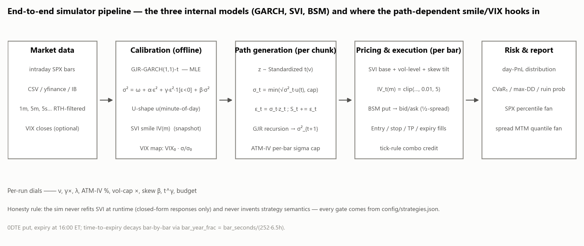
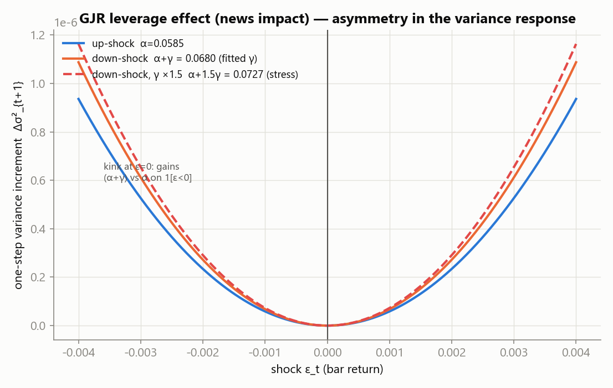
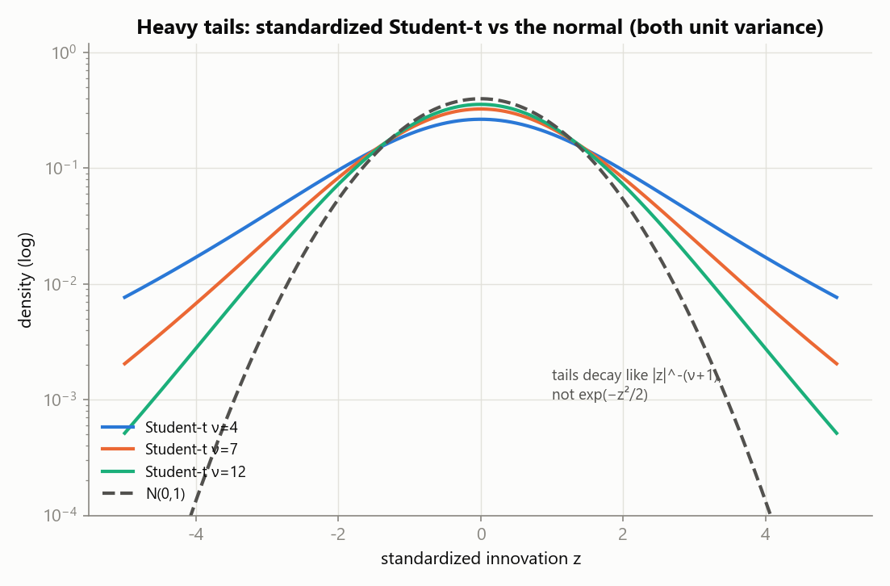
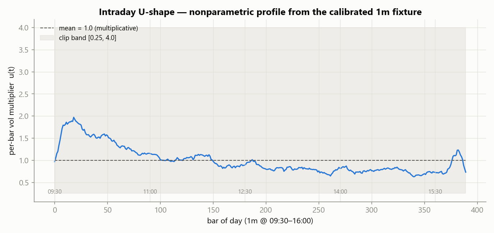
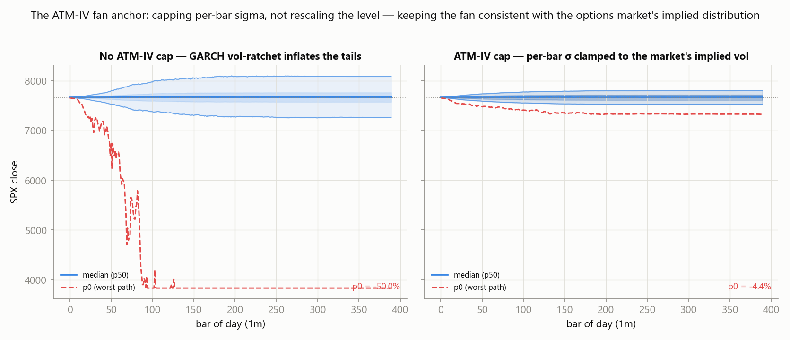
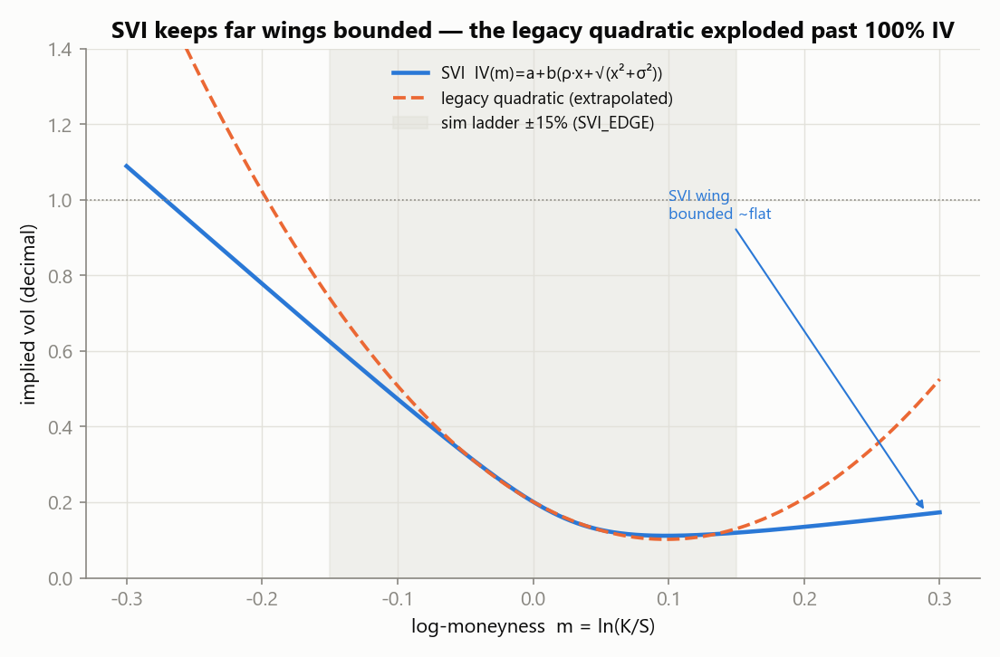
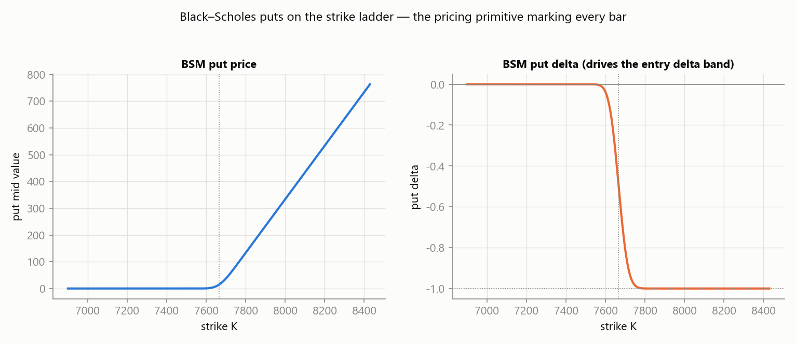
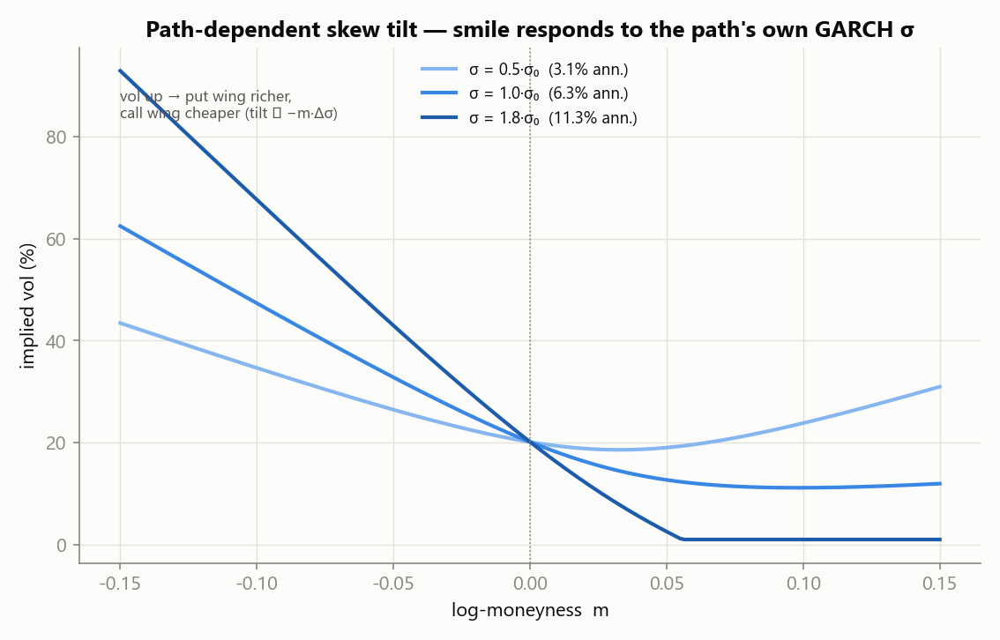
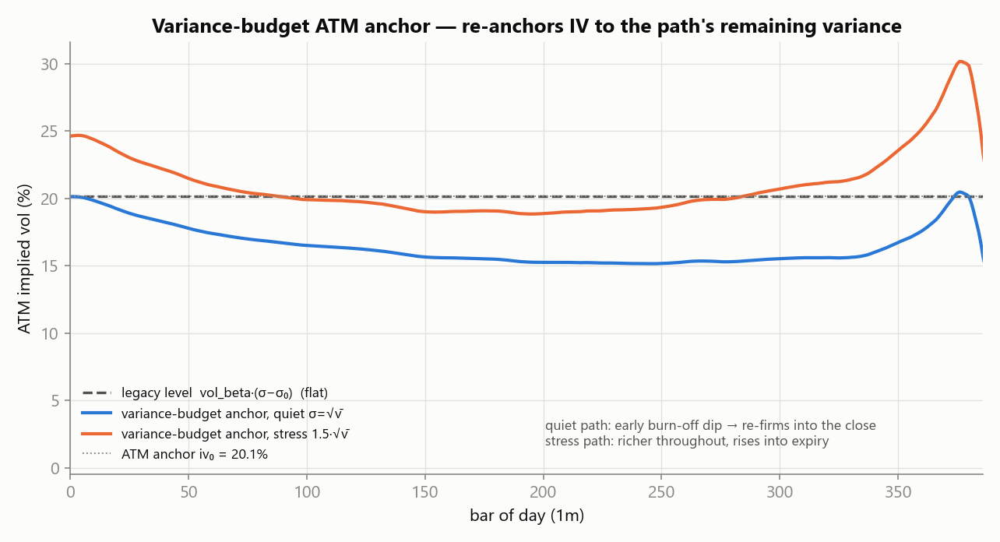
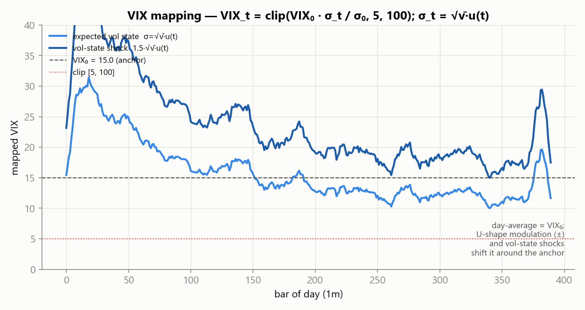

# SPX 0DTE Intraday Monte Carlo Simulator — Technical Report

> What the simulator is, why each model was chosen, and how the smile and VIX
> respond *path-by-path* to the simulated market. Every figure below is produced
> by the simulator's own model code, calibrated on the committed 1-minute SPX
> fixture (`tests/fixtures/SPX_1min_sample.csv`). The numbers in the captions are
> real outputs, not schematics.

---

## 1. What the simulator does

A daily Monte Carlo is meaningless for a 0DTE **bull put spread**: the trade's
fate is decided intraday — the theta-vs-gamma race, the U-shaped volatility, crash
clustering — not by a single terminal price. So the simulator generates N *intraday*
SPX paths from a calibrated volatility model, marks a spread to market every bar
under a vol-linked implied-vol smile, runs the *same* strategy definitions the live
engine uses (entry gates, tick-rule fills, stop / take-profit / expiry), and
reports the day-PnL distribution plus tail risk.

<figure>
  
  <figcaption><b>Figure 1.</b> The pipeline. Three internal models — GJR-GARCH
  (returns), SVI (smile), BSM (option value) — are separate and only meet at the
  per-bar pricing call. Two hooks make the world *path-dependent*: the ATM-IV
  sigma cap in path generation, and the smile/VIX response in pricing.</figcaption>
</figure>

**Design posture.** The sim is a faithful-but-honest harness, not a research toy:

- *No invented strategy semantics.* Every entry condition and exit rule is read
  from `config/strategies.json` and evaluated with the same defaults as the live
  `strategy_engine`. A gate the sim cannot faithfully evaluate is *rejected loudly*
  (e.g. `trend` / `atm_iv`), never silently skipped.
- *Closed-form dynamics only.* The SVI is fitted once, offline, and never refit at
  runtime — the path-dependent response is a closed-form level/tilt on top of the
  captured snapshot.
- *Isolated and safe.* The engine only reads `Strategy` objects; it never places an
  order or touches live state.

---

## 2. Model 1 — GJR-GARCH(1,1) with Student-t innovations

The return process is a classic **GJR-GARCH(1,1)** (Glosten–Jagannathan–Runkle,
the asymmetric extension of GARCH) with **Student-t** innovations:

```
σ²_t = ω + α·ε²_{t−1} + γ·ε²_{t−1}·1[ε_{t−1} < 0] + β·σ²_{t−1}     (volatility)
ε_t  = σ_t · u(minute-of-day) · z_t ,   z ~ standardized t(ν)       (returns)
```

### 2.1 Fitting (MLE with variance targeting)

The five parameters `(ω, α, γ, β, ν)` are estimated by maximum likelihood with
`scipy.optimize.minimize` (Nelder–Mead, multi-start over `ν ∈ {ν₀, 4, 10}`, two
polish passes). Two structural constraints are enforced in the objective:

- **Stationarity** — `α + γ/2 + β < 1` (else the variance path explodes).
- **Variance targeting** — `ω = σ̄²·(1 − α − γ/2 − β)`, so the model's unconditional
  variance equals the sample variance of the de-meaned log-returns.

The fit has two graceful-degradation guards. If MLE fails to converge, a preset
`(α=0.04, γ=0.10, β=0.85, ν=6.0)` is used and **flagged in the UI**. A flat /
zero-variance return series short-circuits straight to the variance-targeted
preset, because the Student-t likelihood is degenerate there (Nelder–Mead can
"converge" to a nonsense interior point instead of failing).

### 2.2 The leverage effect (asymmetry)

`γ > 0` means a *negative* return raises next-bar variance by `(α+γ)·ε²` while a
positive one raises it by only `α·ε²` — the well-known **news-impact asymmetry**
(vol goes up more after a down-move than an up-move of the same size).

<figure>
  
  <figcaption><b>Figure 2.</b> One-step variance increment vs the shock ε, held at
  the unconditional state. The response is kinked at ε=0: downside gets `α+γ`,
  upside gets `α`. The stress dial `gamma_mult` scales γ (dashed) to amplify crash
  clustering. (On this calm fixture the fitted γ is small, so the kink is gentle.)</figcaption>
</figure>

### 2.3 Student-t innovations

Empirical equity returns have fatter tails than a Gaussian. The innovations are
Student-t with `ν` degrees of freedom, then **variance-standardized** by
dividing by `√(ν/(ν−2))` so `E[z²] = 1` and the return scale stays interpretable
(the model requires `ν > 2` for finite variance).

<figure>
  
  <figcaption><b>Figure 3.</b> Standardized Student-t (unit variance) vs N(0,1) on a
  log axis. Tails decay like `|z|^-(ν+1)` instead of `e^{−z²/2}` — large shocks are
  far more likely, which is what generates the crash clusters and the low-ν stress
  dial. Lower ν → fatter tails (the `nu_override` stress dial).</figcaption>
</figure>

### 2.4 Intraday U-shape volatility

SPX intraday volatility is not flat: it is high at the open, decays through the
morning, troughs around midday, and ramps into the close. This is captured as a
**nonparametric multiplicative profile** `u(minute-of-day)`, estimated from the
normalized mean `|ε|` per minute-of-day bucket and smoothed; it requires no
assumed functional form.

<figure>
  
  <figcaption><b>Figure 4.</b> The calibrated U-shape from the 1m fixture. Mean 1.0
  (so it scales the fitted vol up/down), clipped to `[0.25, 4.0]`. Applied as
  `σ_t = √σ²_t · u(t)` — the open spike and close ramp are why an 0DTE spread needs
  an *intraday* sim, not a daily one.</figcaption>
</figure>

### 2.5 The near-integrated ratchet — and the ATM-IV cap

This is the single most important modeling subtlety, and it is not about Student-t.
A GARCH fit on calm data can be **near-integrated**: `α + γ/2 + β ≈ 0.99` (this
fixture gives **0.9895**). The conditional variance then has a heavy-tailed
stationary distribution, so a small subset of simulated paths ratchet the vol state
up to 5–10× the fitted `σ₀`. The fan's *center* (p25–p75) is already market-consistent;
only the tails are pathological — a 1-day p0 of −25% or worse, and here it runs all
the way into the ±50% spot guard band. Critically, the problem is **not** fixed by
using normal instead of t innovations (it reproduces), and it is **not** fixed by
rescaling the *level* of vol (that blows up to NaN through the same ratchet).

The fix is a **cap on the per-bar sigma**, not a level shift:

```
σ_t = min( √σ²_t · u(t),  vol_cap_mult · (atm_iv / √252) / √steps )
```

With `atm_iv` set to the market's current ATM IV (annual decimal) and the default
`vol_cap_mult = 2.0`, each per-bar move is bounded by the IV-implied vol, so the
median session still resembles the data while the tails match what the options
market prices.

<figure>
  
  <figcaption><b>Figure 8.</b> The SPX percentile fan (p0…p95). <b>Left:</b> no cap —
  the unwrapped GARCH ratchet drives the worst path into the −50% guard band (p5
  already −5.2%). <b>Right:</b> with `atm_iv = 16.5%` the fan is market-consistent —
  p0 −4.4%, p5 −1.8%, p95 +1.8%. Median (±1.3%) is unchanged: only the pathological
  tails are trimmed. p0 is a single worst path.</figcaption>
</figure>

> **Bottom line.** The ATM-IV anchor is the lever that reconciles a calm *realized*
> vol (this fixture: 6.3% annual, ~0.4%/day) with the *implied* vol the options
> market actually trades (here ~16.5%, consistent with a ~15 VIX). Without it, the
> fan's tails are a model artifact of a near-integrated fit, not a statement about
> the market.

---

## 3. Model 2 — The SVI smile

Options aren't priced at a single vol. IV varies with moneyness: richer (higher IV)
on the put side (negative skew), a shallow dip around ATM, and a slight firm-up on
far calls. The sim captures this with an **SVI (Stochastic Volatility Inspired)**
parameterization in log-moneyness `m = ln(K/S)`:

```
IV(m) = a + b·( ρ·(m − m₀) + √((m − m₀)² + σ²) )
```

`a` is the level, `b` the wing steepness, `ρ` the skew (negative → put skew), `m₀`
the vertex, `σ` the curvature width.

### 3.1 Why SVI replaced the legacy quadratic

The older quadratic fit `IV(m) = c₀ + c₁·m + c₂·m²` is fine within the observed
±5–6% moneyness band, but the sim prices puts out to **±15%** (`ladder_range_pct`),
so the smile is *extrapolated*. A parabola blows up past ~100% IV in the wings,
producing arbitrage-invalid credits. SVI's square root makes the wings grow roughly
linearly and stay bounded.

<figure>
  
  <figcaption><b>Figure 5.</b> SVI (blue) vs the legacy quadratic (dashed) fitted
  to the same +/-6% put band and extrapolated. Beyond the sim ladder (±15%, shaded)
  the quadratic shoots well past 100% IV; SVI stays bounded and monotone. The shaded
  ±15% band is where the sim actually prices.</figcaption>
</figure>

### 3.2 Fit and guards

`(a, b, ρ, m₀, σ)` are fitted to the live chain's put IVs, from multi-initialization
seeds (a deterministic quadratic seeding plus wing-slope estimates). The fit **solves
under the guard envelope as constraints** (SLSQP). This matters on a real 0DTE chain:
its skew is so steep that the unconstrained optimum sits on the `b` bound with σ → 0 and
its wings blow past the cap, so every seed used to be thrown away and the capture failed
even though a perfectly good bounded fit existed. The guards below now assert the result;
a fit that still cannot satisfy them falls back to the default snapshot and the capture
reports which guard rejected it.

| Guard | Purpose |
|---|---|
| `SVI_WING_CAP = 1.0`, floor `0.005` | No >100% IV, no non-finite values on `[−15%, +15%]` |
| Monotone put wing on `[−15%, 0]` | No butterfly / vertical-arbitrage flip |
| No negative IV outside `±30%` | Extrapolation sanity |
| Put skew ≥ `SVI_MIN_PUT_SKEW` (1 vol pt) | Reject a flat, information-free smile |
| RMSE within `1.4826 × MAD` of the chain | Reject a fit that ignores part of the chain — a robust spread, so one wild quote cannot inflate the baseline enough to admit a bad fit |

IV(m) is convex in m, so the envelope collapses to a handful of scalar inequalities — the
two endpoint caps, the band minimum at the clamped vertex, and the wing-slope sign at
m = 0 — which the solver honours directly.

**Capture input hygiene.** A live 0DTE chain is mostly vega-less quotes: far-OTM puts
with no bid (ask pinned on the 0.05 tick), strikes whose mid is stuck on the tick floor (a
constant price across a dozen strikes produces a fake IV hump no convex SVI can match),
and deep-ITM puts whose mid is nearly pure intrinsic. `smile_capture_points` drops them
(a bid of at least two ticks — `0.10` — plus `0.005 ≤ |Δ| ≤ 0.75`) before the fit sees
them, and moneyness is mapped
with the chain snapshot's own spot so `m` and IV describe the same instant.

The snapshot source is a **live chain capture** (`config/sim_smile.json`) when the
IB quote cache is available, else a bundled default (`config/sim_smile_default.json`,
ATM IV ~20%), else built-in constants. The captured-vs-defaulted state is shown in
the calibration panel.

---

## 4. Model 3 — BSM pricing and the spread

0DTE SPXW settles at the 16:00 ET close; every contract is a **0DTE put**, with
time-to-expiry decaying bar by bar `T_t = (steps−1−t) · bar_seconds/(252·6.5h)`.
Value is Black–Scholes (the same math family as the live `gex_calculator`):

```
d1 = [ln(S/K) + (r + ½σ²)·T] / (σ√T),  d2 = d1 − σ√T
put = K·e^{−rT}·Φ(−d2) − S·Φ(−d1)
```

<figure>
  
  <figcaption><b>Figure 10.</b> BSM put price and delta on the strike ladder.
  Delta drives the entry `short_delta` band; the price curve drives credit. The
  ladder is a fixed 5-pt grid over ±15% of the entry spot.</figcaption>
</figure>

The *mid* is `put(S,K,T,σ_iv)`. The **entry fill** is the spec's honest rule —
never better than the natural, tick-floored: `fill = min(floor_to_tick(mid), S_bid − L_ask)`,
floored at one tick. Synthetic bid/ask = mid ± ½ · `half_spread(m)`, where the
half-spread widens with moneyness (`0.05·(1 + 8|m|)`).

---

## 5. Path-dependent smile dynamics — the heart of the sim

This is what makes the world respond to the path: the smile is **not fixed**, it
moves with each simulated path's own volatility state. All dynamics live behind one
value object (`SmileDynamics`) evaluated per bar `t` as:

```
IV_t(m) = clip( base(m) + level_t + tilt_t ,  0.01, 5.0 )
```

- **`base(m)`** — the captured SVI snapshot.
- **`level_t`** — scales the whole curve with the path's vol state.
- **`tilt_t`** — skews the curve with the path's vol state (put-rich on a vol shock).

Three orthogonal channels can be dialed independently; every one defaults to a
neutral value that reproduces the legacy formula **bit-for-bit** (validated by a
pinned regression chain).

### 5.1 Vol-level link (legacy λ)

The original channel: `level = vol_beta · (σ_path − σ₀)`, a linear shift of the
whole smile with the path's per-bar sigma. `vol_beta` default 0.75; `0` = static
smile. It is a *subtle* nudge — the level mostly comes from the snapshot.

### 5.2 Skew tilt (σ-driven, with expiry amplification)

`skew_beta > 0` tilts the IV curve when the path's GARCH sigma deviates from its
calibrated mean: put wings get richer, call wings cheaper, ATM exactly unchanged.
`skew_t_gamma` (0..1, literature anchor ~0.4) amplifies the tilt toward expiry via
`(T₀/T)^γ`:

```
tilt_t = −skew_beta · (t_scale_t)^{skew_t_gamma} · clamp(σ/σ₀ − 1, −1, +3) · m
t_scale_t = T₀ / max(T_t, ½·bar)
```

The vol ratio is clamped to `[−1, +3]` so an unwrapped tail can't throw the wing
into absurdity. **Closed-form, never refit** — the SVI is not re-fitted at runtime.

<figure>
  
  <figcaption><b>Figure 6.</b> The tilt at a late bar (t_scale amplified): higher
  path vol (dark) makes the put wing richer and the call wing cheaper; ATM is
  pinned at the anchor (~20%). The annualized labels use the fixture's realized vol
  (6.3%); the *skew shape*, not the level, is what the tilt moves.</figcaption>
</figure>

### 5.3 Variance-budget ATM anchor

`atm_budget = true` replaces the flat level with a **closed-form GJR conditional
expectation**: ATM IV each bar is re-anchored to the model's *annualized remaining
expected variance* given the path's sigma state, weighted by the intraday U-shape,
and normalized so the first bar matches the captured snapshot exactly:

```
p_eff = α + γ·γ_mult/2 + β                    (persistence; /2 from E[1[ε<0]·ε²] = ε²/2)
v̄    = ω / (1 − p_eff)                         (unconditional variance)
u2_k  = u(k)² · bar_frac
S(t) = Σ_{k>t} u2_k ,  P(t) = Σ_{k>t} p_eff^{k−t} · u2_k
A(t) = v̄·(S(t) − P(t)) ,  B(t) = P(t)
σ²_t = v̄ + budget_beta·(σ²_path − v̄)
v_t  = A(t) + B(t)·σ²_t
level = iv₀·(√(v_t/v₀ · t_scale_t) − 1)   ,  v₀ = v̄·S(0)
```

Quiet paths now show the model's *intraday IV profile* — early burn-off and
progressive firm-up into the close (the trough's depth/timing tracks the close-bucket
weight) — instead of the flat legacy level.

<figure>
  
  <figcaption><b>Figure 7.</b> ATM IV across the day. The legacy level (grey dashed)
  is flat. The budget anchor (blue, quiet state σ=√v̄) burns off to ~15% midday then
  firms back to the anchor into the close; a stressed state (orange, 1.5·√v̄) is
  richer throughout and *rises* into expiry. `budget_beta` is the A/B dial for how
  strongly the anchor tracks the GARCH state.</figcaption>
</figure>

> **Note on the residual.** The anchor is the *theory* value — remaining variance
> scales with the persistent GARCH state, so it is materially stronger than the
> linear `vol_beta` link. The variance-risk-premium burn-off that makes real quiet-day
> *late* IV lower than the model expects is an accepted residual, not modeled.

### 5.4 VIX mapping

There is no simulated VIX process. The `volatility` entry condition tests a **proxy**:
`VIX_t = clip(VIX₀ · σ_path,t / σ₀, 5, 100)`, with σ₀ the calibrated mean per-bar
vol and VIX₀ its matching VIX mean (last 20 closes when available, else 20.0).
The `volatility` condition reads this proxy, never a real VIX index.

<figure>
  
  <figcaption><b>Figure 9.</b> The VIX proxy along the *expected* vol state
  `σ_t = √v̄·u(t)` anchored at VIX₀=15 (illustration; the fixture has no VIX series).
  Day-average ≈ VIX₀; the U-shape modulates it ±, a vol-state shock shifts it up.
  The clip `[5,100]` is the guard. A real GARCH path's vol state can push the proxy
  far higher than this — again the near-integrated story of Fig 8.</figcaption>
</figure>

### 5.5 Validation methodology

Because the dynamics are closed-form and gated, they are validated by a **pinned
bit-identical chain**: with neutral dials (`skew_beta = skew_t_gamma = 0`,
`atm_budget = false`) every output must equal the committed baselines via
`np.array_equal` — not `allclose`. The chains run `legacy → A → AB → ABC`, each
gate test proving that turning a channel *off* reproduces the previous stage exactly
and that the previous stage's output byte-for-byte matches its `.npz`. This means
adding a dial can never silently change behavior the old run relied on.

---

## 6. Risk analytics and experiment surface

The per-cell payload (`sim_risk.py`) computes:

- **Day-PnL distribution** — mean, median, σ, win rate, CVaR₅ / CVaR₁, worst day.
- **Exit-reason breakdown** — expired / stopped / take-profit / never-entered.
- **Intraday max drawdown** from each trial's per-minute MTM series.
- **Bootstrap equity curves** — sample day PnLs into sequences of `bootstrap_len`
  days, giving a max-DD distribution and **ruin probability** `P(max DD ≥ threshold)`
  as a fraction of account equity (default 20%).

And three experiment surfaces: **stop-loss multiplier sweeps**, **fixed-vs-dynamic
short-strike distance** (`dynamic_k`), and **stress dials** (ν, γ×, λ / σ, skew β,
t^γ, budget) for A/B against a baseline. The report also emits the **SPX percentile
fan** (Fig 8) — a property of the market sim, identical across sweep rows — and a
**spread MTM quantile fan**.

---

## 7. Honest limitations

- **Implied vs realized are not tied together.** Options are priced at the smile
  snapshot's IV (ATM ~20% by default; ~16.5% when dialed) while the underlying moves
  at the *data's* realized vol (6.3% here). A calm CSV + a high smile → far-OTM
  short puts ~2–2.5% OTM are rarely reached, giving near-100% win rates that reflect
  the vol-world mismatch, not edge. Mitigations: capture a live smile, use realistic
  data, read sweep rows *relatively*, and set the ATM-IV anchor.
- **Stop checks on bar closes.** An intra-bar spike-and-revert through the trigger is
  invisible at 1m; finer bars (CSV 5s) shrink this blind spot.
- **One entry per strategy per day.** No re-entry beyond the family child mechanism;
  family mode does not support SL/k sweeps.
- **trend / pmove / RSI / atm_iv gates are not simulated** — a strategy enabling one
  is rejected, not mis-simulated.
- **bear_call is not simulated** — non-`bull_put` strategies are refused.
- **`state.vix` is a proxy**, not a VIX process; the `volatility` condition tests it.

---

## 8. Symbols and constants quick-reference

| Symbol | Meaning | Value here (1m fixture) |
|---|---|---|
| `α, γ, β` | GJR coefficient / leverage / persistence | 0.0585 / 0.00946 / 0.92629 |
| `ν` | Student-t dof | 7.38 (fit) |
| `Σ = α+γ/2+β` | persistence (near-integrated if ~0.99) | **0.9895** |
| `ω` | GARCH intercept (variance-targeted) | 4.76e-10 |
| `σ₀` | mean per-bar vol (calibration) | 2.00e-4 → 6.3% ann |
| `√v̄` | unconditional vol | 2.13e-4 |
| `iv₀` | ATM IV from snapshot | 20.1% |
| `bar_time` | 1m year fraction `60/(252·6.5h)` | 2.93e-5 yr |
| `r` | risk-free rate | 4.3% |
| `vol_cap_mult` | per-bar cap multiple of IV-implied | 2.0 |
| `atm_budget, budget_beta` | variance-budget anchor | off / 1.0 (theory) |
| `vol_beta` | legacy vol-level link (λ) | 0.75 |
| `skew_beta, skew_t_gamma` | tilt strength / expiry exponent | 0 / 0 (→ 0.4 lit) |
| `VIX₀` | VIX anchor (fallback / illustration) | 20.0 / 15 |
| RTH day | bars at 1m / 5m | 390 / 78 |

*Figures generated by `docs/figures/gen_sim_report_figs.py`; rerun it from the repo
root to regenerate. Reproduce the calibration with:*

```python
from sim_data import parse_csv
from sim_config import SimRunConfig
from sim_calibrate import calibrate
cfg  = SimRunConfig(strategy_name="T", source="csv",
                    csv_path="tests/fixtures/SPX_1min_sample.csv", bar_size="1m")
model = calibrate(parse_csv(cfg.csv_path, 60), cfg)
```
