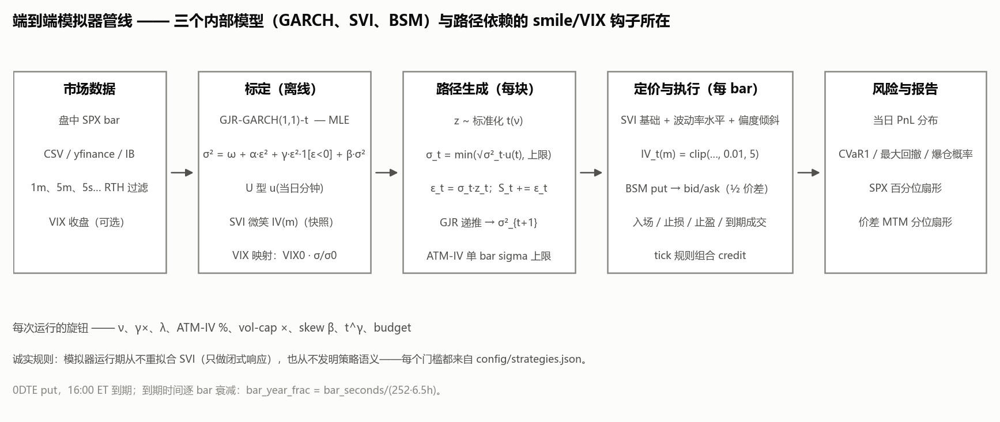
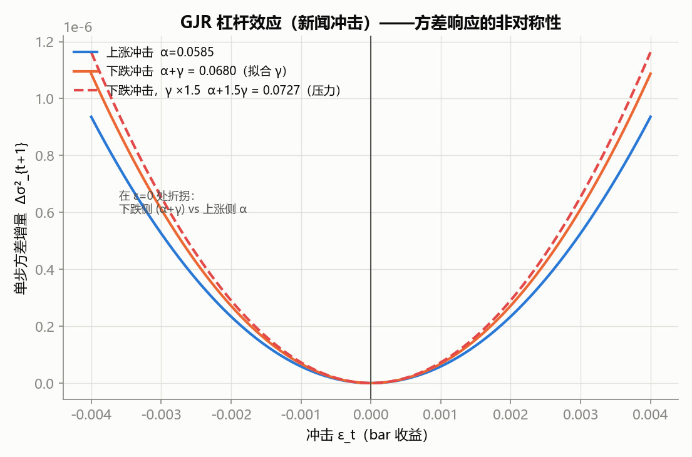
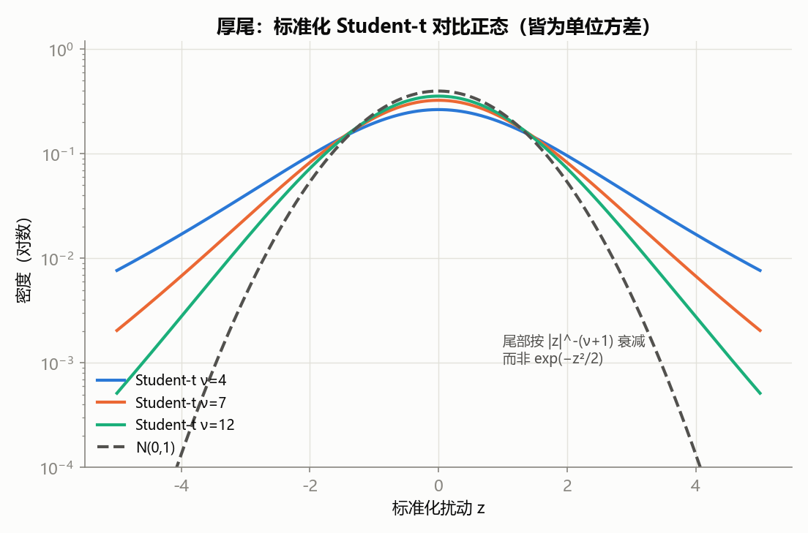
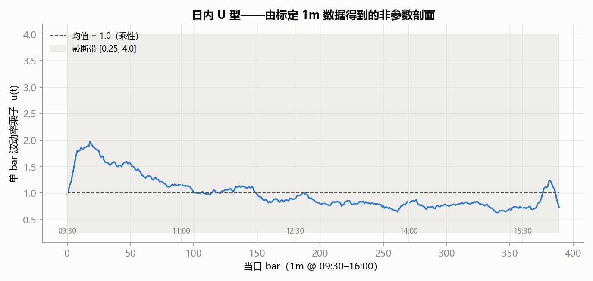
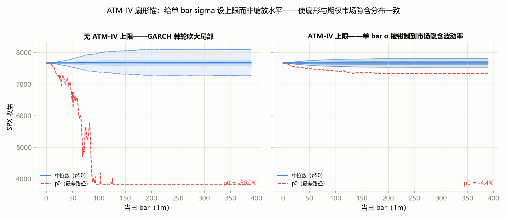
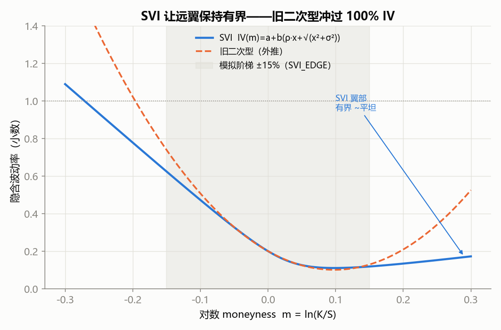
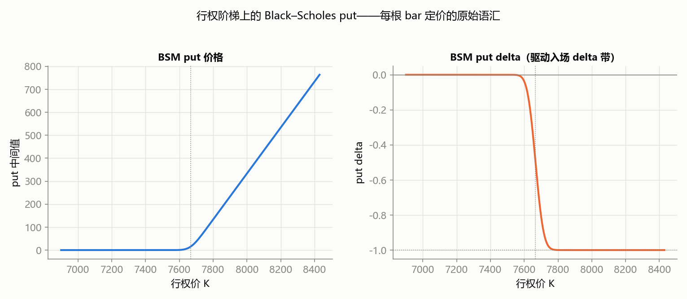
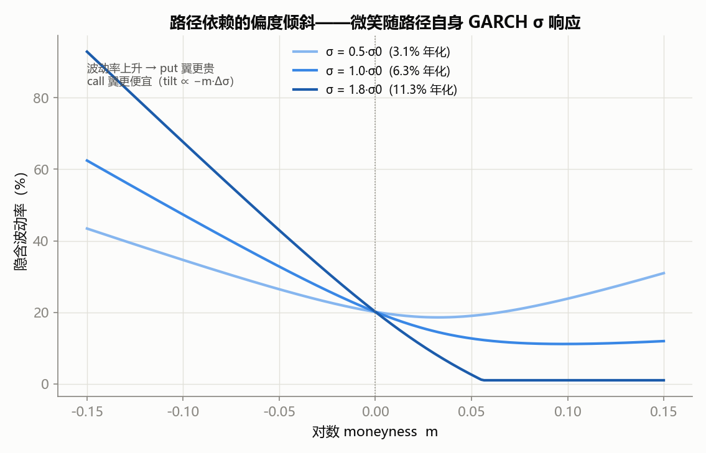
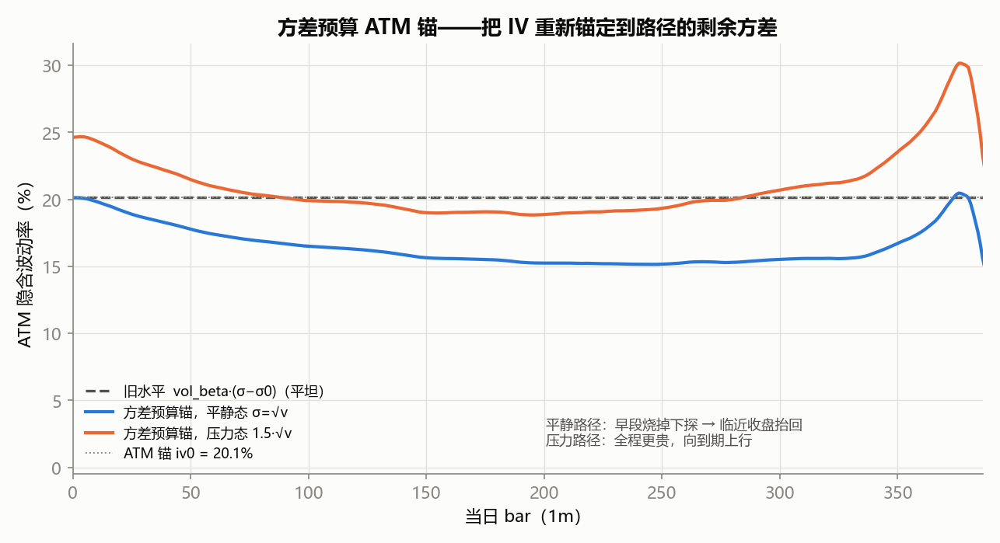
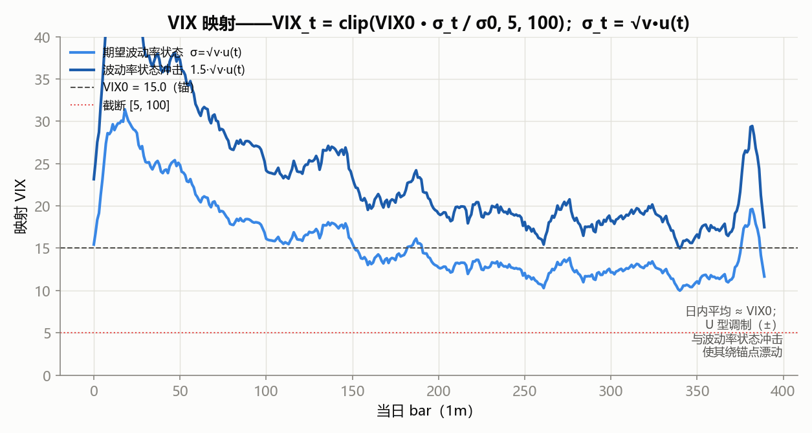

# SPX 0DTE 日内蒙特卡洛模拟器 — 技术报告

> 这套模拟器是什么、为什么选用这些模型，以及 smile（波动率微笑）与 VIX 如何**逐条路径**地对模拟行情做出响应。下图全部由模拟器自身的模型代码生成，标定于仓库自带的 1 分钟 SPX 数据（`tests/fixtures/SPX_1min_sample.csv`）。图注中的数字是真实输出，不是示意图。

---

## 1. 模拟器在做什么

对一个 0DTE **bull put 价差**来说，日度蒙特卡洛毫无意义：这笔交易的成败由**日内结构**决定——theta 与 gamma 的赛跑、U 型波动、崩盘聚集——而不是单一到期价格。所以模拟器从标定好的波动率模型生成 N 条 *日内* SPX 路径，每根 bar 在一条与波动率联动的隐含波动率微笑下对价差做市值盯市(mark-to-market)，然后用与实盘引擎**相同**的策略定义（入场条件、tick 规则成交、止损 / 止盈 / 到期）来判定，最后输出当日 PnL 分布与尾部风险。

<figure>
  
  <figcaption><b>图 1.</b> 整体管线。三个内部模型——GJR-GARCH（收益）、SVI（微笑）、BSM（期权价值）——彼此独立，只在逐 bar 定价那一处相遇。两个钩子让世界变得**路径依赖**：路径生成里的 ATM-IV 波动率上限，以及定价一侧的 smile/VIX 响应。</figcaption>
</figure>

**设计立场。** 模拟器是一个"忠实但诚实"的测试台，不是研究性质的玩具：

- *不发明策略语义。* 每条入场条件与出场规则都从 `config/strategies.json` 读取，并用与实盘 `strategy_engine` 相同的默认值求值。模拟器**无法忠实求值**的门槛（如 `trend` / `atm_iv`）会被**显式拒绝**，而不是被静默跳过。
- *只用闭式(closed-form)动力学。* SVI 在离线状态下拟合一次，运行期**绝不重新拟合**——路径依赖的响应是叠加在已捕获快照之上的闭式 level/tilt。
- *隔离且安全。* 引擎只*读取* `Strategy` 对象，绝不下单、绝不触碰实盘状态。

---

## 2. 模型一 — 带 Student-t 扰动的 GJR-GARCH(1,1)

收益过程是经典的 **GJR-GARCH(1,1)**（Glosten–Jagannathan–Runkle，即 GARCH 的非对称推广），扰动为 **Student-t**：

```
σ²_t = ω + α·ε²_{t−1} + γ·ε²_{t−1}·1[ε_{t−1} < 0] + β·σ²_{t−1}     （波动率）
ε_t  = σ_t · u(分钟) · z_t ,   z ~ 标准化 t(ν)                       （收益）
```

### 2.1 拟合（方差目标 + MLE）

五个参数 `(ω, α, γ, β, ν)` 用 `scipy.optimize.minimize`（Nelder–Mead，`ν ∈ {ν₀, 4, 10}` 多重初值 + 两次精修）做最大似然估计。目标函数里强加两条结构性约束：

- **平稳性** — `α + γ/2 + β < 1`（否则方差路径会爆炸）。
- **方差目标** — `ω = σ̄²·(1 − α − γ/2 − β)`，使模型的无条件方差等于去均值对数收益的样本方差。

拟合有两条优雅退化的保护。若 MLE 不收敛，则回退到预设值 `(α=0.04, γ=0.10, β=0.85, ν=6.0)` 并**在 UI 中标记**。方差为零/恒定的收益序列会直接短路到方差目标预设，因为此时 Student-t 似然退化（Nelder–Mead 可能"收敛"到无意义的内部点而不是报错）。

### 2.2 杠杆效应（非对称性）

`γ > 0` 意味着**负收益**会让下一根 bar 的方差上升 `(α+γ)·ε²`，而正收益只上升 `α·ε²`——这就是著名的**新闻冲击不对称**（同样幅度下，下跌比上涨更能推高波动率）。

<figure>
  
  <figcaption><b>图 2.</b> 在无条件状态下，单步方差增量对冲击 ε 的响应。响应在 ε=0 处折拐：下跌侧用 `α+γ`，上涨侧用 `α`。压力旋钮 `gamma_mult` 放大 γ（虚线）以增强崩盘聚集。（在这份较平静的数据上拟合出的 γ 偏小，所以折拐较缓。）</figcaption>
</figure>

### 2.3 Student-t 扰动

实证股票收益的尾部比高斯更厚。扰动服从自由度为 `ν` 的 Student-t，然后**方差标准化**（除以 `√(ν/(ν−2))`）使 `E[z²] = 1`，收益尺度仍可解释（模型要求 `ν > 2` 以保证方差有限）。

<figure>
  
  <figcaption><b>图 3.</b> 标准化 Student-t（单位方差）对比 N(0,1)，对数轴。尾部按 `|z|^-(ν+1)` 衰减，而不是 `e^{−z²/2}`——大幅冲击的概率高得多，这正是崩盘聚集与低 ν 压力旋钮的来源。ν 越小尾部越厚（`nu_override` 压力旋钮）。</figcaption>
</figure>

### 2.4 日内 U 型波动率

SPX 日内波动率并不平坦：开盘高、上午衰减、午间触底、临近收盘抬升。这里用**非参数乘性剖面** `u(分钟)` 刻画，由每个分钟桶的标准化平均 `|ε|` 估计并平滑；无需预设任何函数形式。

<figure>
  
  <figcaption><b>图 4.</b> 由 1m 数据标定出的 U 型。均值 1.0（因此只对拟合出的波动率做相对缩放），截断于 `[0.25, 4.0]`。应用方式为 `σ_t = √σ²_t · u(t)`——开盘尖峰与收盘抬升正是 0DTE 价差需要*日内*模拟而非日度模拟的原因。</figcaption>
</figure>

### 2.5 近积分棘轮 — 与 ATM-IV 上限

这是最重要的建模细节之一，且**与 Student-t 无关**。在平静数据上拟合出的 GARCH 可能**近积分**：`α + γ/2 + β ≈ 0.99`（本数据为 **0.9895**）。此时条件方差有一个厚尾平稳分布，于是一小部分模拟路径会**棘轮式**地把波动率状态推到拟合值 `σ₀` 的 5–10 倍。扇形的*中心*（p25–p75）其实已接近市场一致；**只有尾部病态**——1 天 p0 达到 −25% 或更糟，此处直接冲进 ±50% 的现货保护带。关键：这个问题**不是**靠改用正态扰动解决的（复现），也**不是**靠整体*缩放*波动率*水平*解决的（会经同一棘轮放大成 NaN）。

正确做法是对**单根 bar 的 sigma 设上限**，而不是改水平：

```
σ_t = min( √σ²_t · u(t),  vol_cap_mult · (atm_iv / √252) / √steps )
```

把 `atm_iv` 设为市场当前 ATM IV（年化小数），用默认 `vol_cap_mult = 2.0`，每一步的波动被限制在 IV 隐含的范围内：中位交易时段仍像你的数据，而尾部则匹配期权市场真正定价的东西。

<figure>
  
  <figcaption><b>图 8.</b> SPX 百分位扇形（p0…p95）。<b>左：</b>无上限——被解开的 GARCH 棘轮把最差路径推进 −50% 保护带（p5 已 −5.2%）。<b>右：</b>`atm_iv = 16.5%` 时扇形与市场一致——p0 −4.4%、p5 −1.8%、p95 +1.8%。中位数（±1.3%）不变：只修掉了病态尾部。p0 是单条最差路径。</figcaption>
</figure>

> **结论。** ATM-IV 锚是调和**平静的实现波动率**（本例：年化 6.3%，约 0.4%/日）与期权市场**真正交易的隐含波动率**（此处约 16.5%，对应约 15 的 VIX）的杠杆。没有它，扇形的尾部是近积分拟合的模型伪影，而不是对市场的陈述。

---

## 3. 模型二 — SVI 微笑

期权并非按单一波动率定价。IV 随 moneyness 变化：put 侧更"贵"（负偏度）、ATM 附近浅降、深虚值 call 略升。模拟器用 **SVI（Stochastic Volatility Inspired）** 参数化捕捉这一点，自变量为对数 moneyness `m = ln(K/S)`：

```
IV(m) = a + b·( ρ·(m − m₀) + √((m − m₀)² + σ²) )
```

`a` 为水平，`b` 为翼部陡峭度，`ρ` 为偏度（负 → put 偏度），`m₀` 为顶点，`σ` 为曲率宽度。

### 3.1 为什么用 SVI 取代旧二次型

旧的二次拟合 `IV(m) = c₀ + c₁·m + c₂·m²` 在观测到的 ±5–6% moneyness 带内没问题，但模拟器要把 put 定价到 **±15%**（`ladder_range_pct`），所以微笑是*外推*出来的。抛物线在翼部会冲过 ~100% IV，产生套利无效的 credit。SVI 的平方根使翼部近似线性增长并保持有界。

<figure>
  
  <figcaption><b>图 5.</b> SVI（蓝）对比旧二次型（虚线），二者拟合于同一 ±6% put 带并外推。越过模拟阶梯（±15%，阴影区）二次型冲过 100% IV；SVI 则保持有界且单调。阴影的 ±15% 是模拟器实际定价的区域。</figcaption>
</figure>

### 3.2 拟合与守卫

`(a, b, ρ, m₀, σ)` 拟合实盘链的 put IV，从多重初值（确定性二次种子 + 翼部斜率估计）出发。拟合**把守卫包络作为约束直接写进优化**（SLSQP）。这一点对真实 0DTE 链是决定性的：它的偏斜极陡，无约束最优解落在 `b` 上界、σ → 0，翼部远超上限，于是每个种子都被丢弃、捕获直接失败——尽管一个完全可用的有界解明明存在。守卫现在只对结果做断言；仍无法满足的拟合才回退到默认快照，并把是哪个守卫拒绝的报出来。

| 守卫 | 目的 |
|---|---|
| `SVI_WING_CAP = 1.0`、下限 `0.005` | `[−15%, +15%]` 内不允许 >100% IV、不允许非有限值 |
| put 翼在 `[−15%, 0]` 上单调 | 不出现蝴蝶 / 垂直套利翻转 |
| `±30%` 外不允许负 IV | 外推合理性 |
| put 偏斜 ≥ `SVI_MIN_PUT_SKEW`（1 个 vol 点） | 拒绝平坦、无信息的微笑 |
| RMSE 在链的 `1.4826 × MAD` 之内 | 拒绝只拟合了部分链的结果——用稳健尺度，单个野报价无法抬高基线来放行坏拟合 |

IV(m) 关于 m 是凸的，所以包络可坍缩为几个标量不等式——两个端点上限、夹进宽区间后的顶点处最小值、以及 m = 0 处的翼部斜率符号——求解器可直接满足。

**捕获输入清洗。** 实盘 0DTE 链大部分是"无 vega"报价：无买价的远虚 put（ask 钉在 0.05 跳动上）、mid 卡在最小跳动的档位（十几个 strike 价格恒为 0.075，制造出凸 SVI 无法拟合的假 IV 驼峰）、以及 mid 几乎等于内在价值的深度实值 put。`smile_capture_points` 在拟合之前就剔除它们（要求买价至少两个跳动 `0.10`，且 `0.005 ≤ |Δ| ≤ 0.75`），并用链快照自己的 spot 做 moneyness 映射，使 `m` 与 IV 描述同一时刻。

快照来源：IB 行情缓存可用时为**实盘链捕获**（`config/sim_smile.json`），否则用内置默认（`config/sim_smile_default.json`，ATM IV ~20%），再否则用内置常量。捕获 vs 默认的状态会在标定面板中显示。

---

## 4. 模型三 — BSM 定价与价差

0DTE SPXW 在 16:00 ET 收盘结算；每张合约都是 **0DTE put**，到期时间逐 bar 衰减 `T_t = (steps−1−t) · bar_seconds/(252·6.5h)`。价值用 Black–Scholes（与实盘 `gex_calculator` 同一数学家族）：

```
d1 = [ln(S/K) + (r + ½σ²)·T] / (σ√T),  d2 = d1 − σ√T
put = K·e^{−rT}·Φ(−d2) − S·Φ(−d1)
```

<figure>
  
  <figcaption><b>图 10.</b> 阶梯上的 BSM put 价格与 delta。delta 驱动入场 `short_delta` 带；价格曲线驱动 credit。阶梯是以入场现货 ±15% 为界的固定 5 点网格。</figcaption>
</figure>

*mid* 为 `put(S,K,T,σ_iv)`。**入场成交**遵循规程的诚实规则——绝不优于自然价、取整到 tick：`fill = min(向下取整到tick(mid), S_bid − L_ask)`，下限一格。合成 bid/ask = mid ± ½ · `half_spread(m)`，半价差随 moneyness 变宽（`0.05·(1 + 8|m|)`）。

---

## 5. 路径依赖的微笑动力学 — 模拟器的核心

这才是让世界对路径做出响应的部分：微笑**不是**固定的，它随每条模拟路径自身的波动率状态移动。所有动力学都收敛到一个值对象（`SmileDynamics`），逐 bar `t` 求值：

```
IV_t(m) = clip( base(m) + level_t + tilt_t ,  0.01, 5.0 )
```

- **`base(m)`** — 已捕获的 SVI 快照。
- **`level_t`** — 随路径的波动率状态整体伸缩曲线。
- **`tilt_t`** — 随路径的波动率状态倾斜曲线（波动冲击时 put 侧变贵）。

三条正交通道可独立调节；每条默认值都是中性值，能**逐比特**复现旧公式（由固定的回归链验证）。

### 5.1 波动率水平联动（旧 λ）

最初的通道：`level = vol_beta · (σ_path − σ₀)`，整体随路径单 bar sigma 线性平移微笑。`vol_beta` 默认 0.75；`0` = 静态微笑。它只是*细微*的微调——水平主要来自快照。

### 5.2 偏度倾斜（σ 驱动，带到期放大）

`skew_beta > 0` 时，当路径的 GARCH sigma 偏离其标定均值，IV 曲线发生倾斜：put 翼变贵、call 翼变便宜、ATM 完全不变。`skew_t_gamma`（0..1，文献锚 ~0.4）用 `(T₀/T)^γ` 在临近到期时放大倾斜：

```
tilt_t = −skew_beta · (t_scale_t)^{skew_t_gamma} · clamp(σ/σ₀ − 1, −1, +3) · m
t_scale_t = T₀ / max(T_t, ½·bar)
```

波动率比值被截断在 `[−1, +3]`，以免未收敛的尾部把翼部抛入荒谬区间。**闭式、绝不重拟合**——运行期不重新拟合 SVI。

<figure>
  
  <figcaption><b>图 6.</b> 晚期 bar（t_scale 放大）的倾斜：路径波动率越高（深色）put 翼越贵、call 翼越便宜；ATM 被钉在锚点（约 20%）。年化标签用的是数据实现波动率（6.3%）；倾斜移动的是*偏度形状*，不是水平。</figcaption>
</figure>

### 5.3 方差预算 ATM 锚

`atm_budget = true` 用**闭式的 GJR 条件期望**取代平坦水平：每根 bar 的 ATM IV 重新锚定到模型*年化剩余期望方差*（给定路径的 sigma 状态），加权日内 U 型，并归一化使第一根 bar 与已捕获快照完全一致：

```
p_eff = α + γ·γ_mult/2 + β                    （持久性；/2 来自 E[1[ε<0]·ε²] = ε²/2）
v̄    = ω / (1 − p_eff)                         （无条件方差）
u2_k  = u(k)² · bar_frac
S(t) = Σ_{k>t} u2_k ,  P(t) = Σ_{k>t} p_eff^{k−t} · u2_k
A(t) = v̄·(S(t) − P(t)) ,  B(t) = P(t)
σ²_t = v̄ + budget_beta·(σ²_path − v̄)
v_t  = A(t) + B(t)·σ²_t
level = iv₀·(√(v_t/v₀ · t_scale_t) − 1)   ,  v₀ = v̄·S(0)
```

平静路径此时呈现出模型的*日内 IV 剖面*——早段烧掉、临近收盘渐进抬升（谷底的深度/时点跟随收盘桶权重）——而不是旧的平坦水平。

<figure>
  
  <figcaption><b>图 7.</b> 全天的 ATM IV。旧的 level（灰虚线）平坦。预算锚（蓝，平静态 σ=√v̄）午间烧到约 15%，临近收盘又抬回锚点；压力态（橙，1.5·√v̄）全程更贵，并*向上*进入到期。`budget_beta` 是控制锚对 GARCH 状态追踪多强的 A/B 旋钮。</figcaption>
</figure>

> **关于残差的说明。** 锚是*理论值*——剩余方差随持久的 GARCH 状态缩放，因此明显强于线性 `vol_beta` 联动。真实平静日*尾盘* IV 之所以低于模型期望，来自方差风险溢价烧掉，这属于被接受的残差，建模中未处理。

### 5.4 VIX 映射

没有模拟的 VIX 过程。`volatility` 入场条件测的是一个**代理**：`VIX_t = clip(VIX₀ · σ_path,t / σ₀, 5, 100)`，其中 σ₀ 是标定得到的平均单 bar 波动率，VIX₀ 是对应的 VIX 均值（有数据时取最近 20 根收盘，否则 20.0）。`volatility` 条件读的是这个代理，从不是真实 VIX 指数。

<figure>
  
  <figcaption><b>图 9.</b> VIX 代理沿*期望*波动率状态 `σ_t = √v̄·u(t)`，钉在 VIX₀=15（演示值；该 fixture 无 VIX 序列）。日内平均 ≈ VIX₀；U 型对它做 ± 调制，波动率状态冲击会把它整体上抬。`[5,100]` 截断是守卫。真实 GARCH 路径的波动率状态可把代理推得远比这更高——这又是图 8 的近积分故事。</figcaption>
</figure>

### 5.5 验证方法论

因为动力学是闭式且分门控的，所以用**固定的逐比特链**验证：中性旋钮（`skew_beta = skew_t_gamma = 0`、`atm_budget = false`）时，每个输出都必须用 `np.array_equal`（而非 `allclose`）匹配已提交基线。链为 `legacy → A → AB → ABC`，每个门控测试都证明：把某通道*关掉*能精确复现上一阶段，且上一阶段输出与它的 `.npz` 逐字节一致。这意味着加一个旋钮永远不会静默改变旧运行依赖的行为。

---

## 6. 风险分析与实验面

每个单元格的有效载荷（`sim_risk.py`）计算：

- **当日 PnL 分布** — 均值、中位数、σ、胜率、CVaR₅ / CVaR₁、最差日。
- **出场原因分解** — 到期 / 止损 / 止盈 / 从未入场。
- **日内最大回撤** — 每条试验的逐分钟 MTM 序列。
- **自助法权益曲线** — 把当日 PnL 抽样进 `bootstrap_len` 天的序列，得到最大回撤分布与**爆仓概率** `P(最大回撤 ≥ 阈值)`，阈值为账户权益的比例（默认 20%）。

以及三类实验面：**止损倍数扫描**、**固定 vs 动态短腿距离**（`dynamic_k`）、**压力旋钮**（ν、γ×、λ/σ、skew β、t^γ、budget）用于对比基线做 A/B。报告还会输出 **SPX 百分位扇形**（图 8）——这是市场模拟本身的属性，各扫描行完全相同——以及**价差 MTM 分位扇形**。

---

## 7. 诚实的局限

- **隐含与现实没有联系起来。** 期权按微笑快照的 IV 定价（默认 ATM ~20%；调到 16.5% 时）而现货按*数据*的实现波动率运动（此处 6.3%）。平静 CSV + 高微笑 → 处于 ~2–2.5% 虚值的 deep-OTM short put 很难够到，得到近乎 100% 的胜率，反映的是波动率世界的错配，而非策略优势。缓解：捕获实盘微笑、用现实的数据、*相对地*读扫描行、并设置 ATM-IV 锚。
- **止损在 bar 收盘检查。** 盘中击穿又回拉、穿过触发价的形态，在 1m 上是看不见的；更细的 bar（CSV 5s）缩小这块盲区。
- **每策略每日只入场一次。** 除 family 子策略触发外不支持再入场；family 模式不支持 SL/k 扫描。
- **`trend` / pmove / RSI / `atm_iv` 门槛不做**——启用其一即拒绝，而非误模拟。
- **`bear_call` 不做**——非 `bull_put` 策略一律拒绝。
- **`state.vix` 是代理**，不是 VIX 过程；`volatility` 条件测的就是它。

---

## 8. 符号与常量速查

| 符号 | 含义 | 此处数值（1m fixture） |
|---|---|---|
| `α, γ, β` | GJR 系数 / 杠杆 / 持久性 | 0.0585 / 0.00946 / 0.92629 |
| `ν` | Student-t 自由度 | 7.38（拟合） |
| `Σ = α+γ/2+β` | 持久性（接近 0.99 即近积分） | **0.9895** |
| `ω` | GARCH 截距（方差目标） | 4.76e-10 |
| `σ₀` | 标定平均单 bar 波动率 | 2.00e-4 → 年化 6.3% |
| `√v̄` | 无条件波动率 | 2.13e-4 |
| `iv₀` | 快照 ATM IV | 20.1% |
| `bar_time` | 1m 年分数 `60/(252·6.5h)` | 2.93e-5 年 |
| `r` | 无风险利率 | 4.3% |
| `vol_cap_mult` | 单 bar 上限 = IV 隐含的倍数 | 2.0 |
| `atm_budget, budget_beta` | 方差预算锚 | 关 / 1.0（理论值） |
| `vol_beta` | 旧波动率水平联动（λ） | 0.75 |
| `skew_beta, skew_t_gamma` | 倾斜强度 / 到期指数 | 0 / 0（→ 0.4 文献值） |
| `VIX₀` | VIX 锚（回退 / 演示） | 20.0 / 15 |
| RTH 交易日 | 1m / 5m 的 bar 数 | 390 / 78 |

*图由 `docs/figures/gen_sim_report_figs.py` 生成；在仓库根目录重跑即可再生成。复现标定：*

```python
from sim_data import parse_csv
from sim_config import SimRunConfig
from sim_calibrate import calibrate
cfg  = SimRunConfig(strategy_name="T", source="csv",
                    csv_path="tests/fixtures/SPX_1min_sample.csv", bar_size="1m")
model = calibrate(parse_csv(cfg.csv_path, 60), cfg)
```
