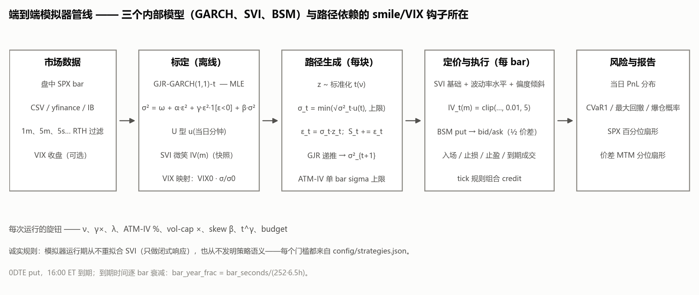
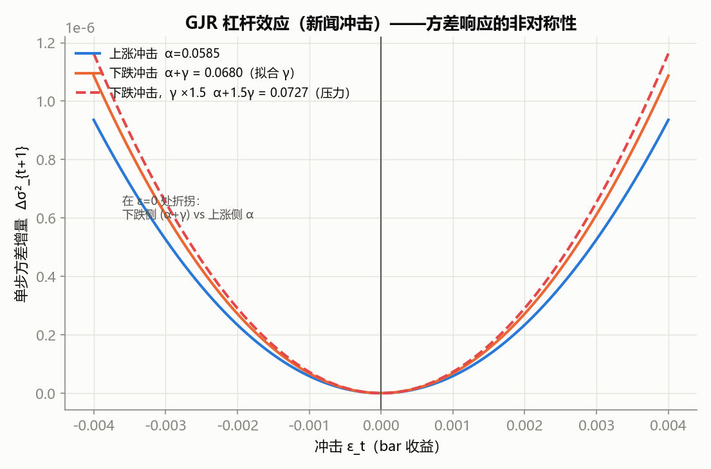
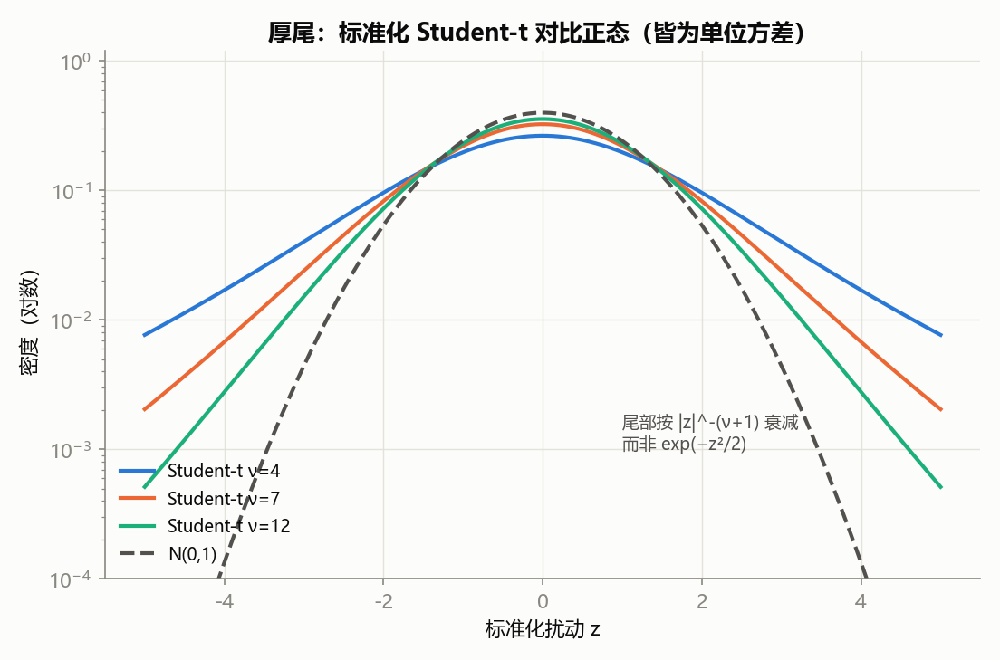
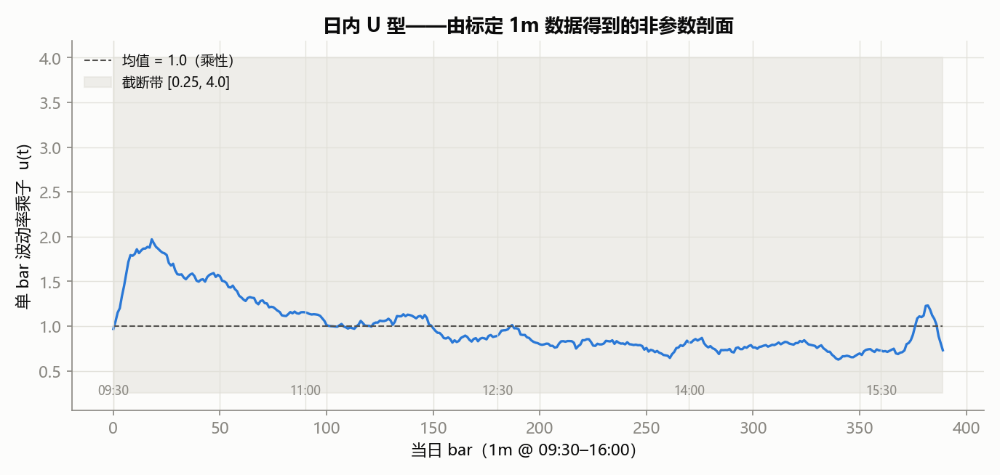
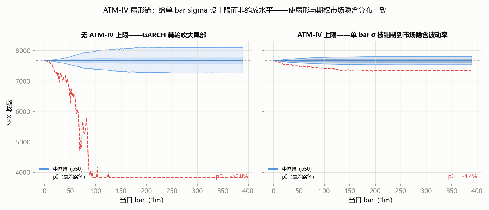
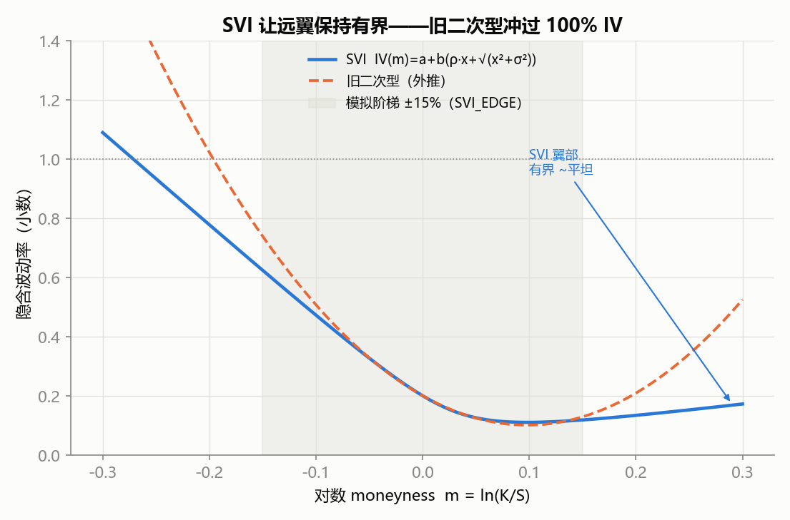
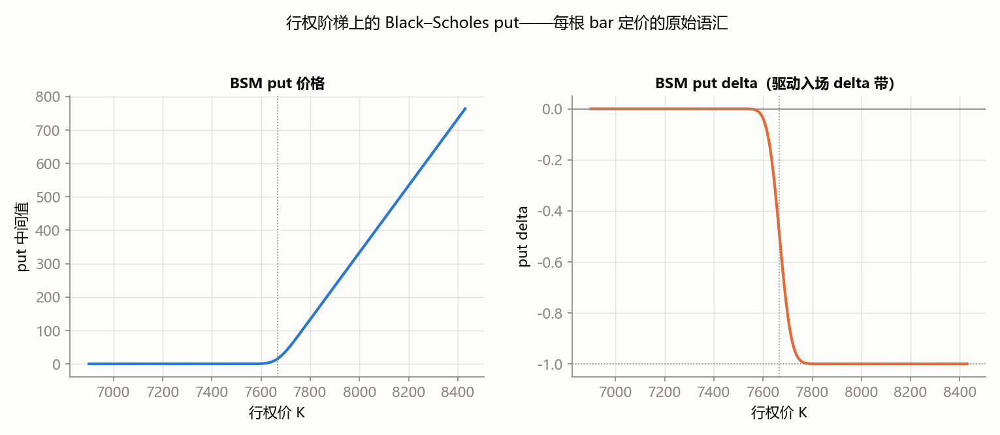
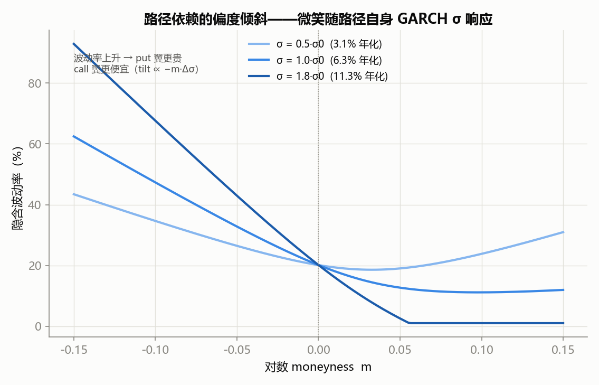
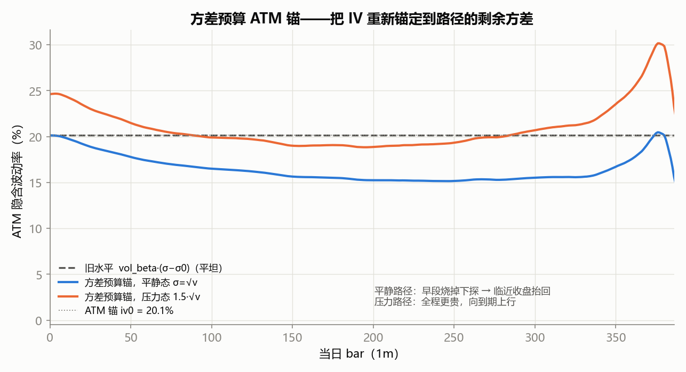
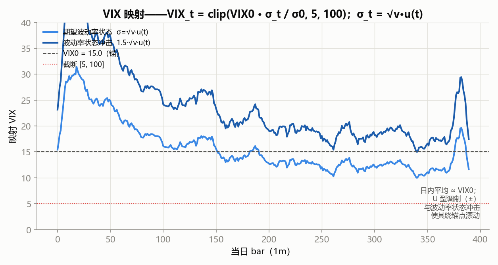

# SPX 0DTE 日内蒙特卡洛模拟器技术报告

> **Note (October 2026):** the option-pricing sections describe the pre-SP2 SVI smile.
> The simulator now prices from the z-model tables; see the README section
> "How the pricer marks options (z-model)". The fan-cap formula in the path section also
> changed to calendar units (`atm_iv x sqrt(390/525600)` per RTH day).

> 本文说明这套模拟器做什么、为什么选这几个模型，以及 smile（波动率微笑）和 VIX 怎样逐条路径地影响模拟行情。所有图都由模拟器自身的模型代码生成，标定数据是仓库自带的 1 分钟 SPX 数据（`tests/fixtures/SPX_1min_10d.csv`），图注里的数字取自实际输出。

---

## 1. 模拟器在做什么

0DTE bull put 价差的盈亏取决于日内走势，到期价格只是最后一个点，所以日度蒙特卡洛帮不上忙。theta 与 gamma 的消长、U 型的日内波动、崩盘时的波动聚集，都发生在日内。

模拟器因此从标定好的波动率模型生成 N 条日内 SPX 路径。每根 bar 在一条随波动率联动的隐含波动率微笑下，对价差做市值盯市（mark-to-market），再用与实盘引擎相同的策略定义（入场条件、按 tick 成交、止损 / 止盈 / 到期）判定结果，最后输出当日 PnL 分布和尾部风险。

<figure>
  
  <figcaption><b>图 1.</b> 整体管线。GJR-GARCH 管收益、SVI 管微笑、BSM 管期权价值，三个模型相互独立，只在逐 bar 定价时汇合。路径依赖只出现在两处：路径生成中的 ATM-IV 波动率上限，以及定价一侧对 smile / VIX 的响应。</figcaption>
</figure>

模拟器按测试台来设计：求值上忠实于实盘，结论上不夸大。

策略语义完全来自实盘。每条入场条件和出场规则都从 `config/strategies.json` 读取，默认值与实盘 `strategy_engine` 一致。模拟器无法忠实求值的门槛（如 `trend`、`atm_iv`）会被直接拒绝，不会静默跳过。

动力学只用闭式（closed-form）公式。SVI 离线拟合一次，运行期不再重新拟合；路径依赖的响应是叠加在已捕获快照上的闭式 level / tilt。

引擎只读取 `Strategy` 对象，不下单，也不触碰实盘状态。

---

## 2. 模型一：带 Student-t 扰动的 GJR-GARCH(1,1)

收益过程用 GJR-GARCH(1,1)（Glosten–Jagannathan–Runkle，GARCH 的非对称推广），扰动项服从 Student-t 分布：

```
σ²_t = ω + α·ε²_{t−1} + γ·ε²_{t−1}·1[ε_{t−1} < 0] + β·σ²_{t−1}     （波动率）
ε_t  = σ_t · u(分钟) · z_t ,   z ~ 标准化 t(ν)                       （收益）
```

### 2.1 拟合（方差目标 + MLE）

五个参数 `(ω, α, γ, β, ν)` 用 `scipy.optimize.minimize` 做最大似然估计（Nelder–Mead，以 `ν ∈ {ν₀, 4, 10}` 作多重初值，再精修两次）。目标函数带两条结构性约束：

- 平稳性：`α + γ/2 + β < 1`，否则方差路径会爆炸。
- 方差目标：`ω = σ̄²·(1 − α − γ/2 − β)`，让模型的无条件方差等于去均值对数收益的样本方差。

退化情形有两条保护。MLE 不收敛时回退到预设值 `(α=0.04, γ=0.10, β=0.85, ν=6.0)`，并在 UI 中标记出来。若收益序列的方差为零或恒定，则直接短路到方差目标预设：此时 Student-t 似然本身退化，Nelder–Mead 可能"收敛"到一个无意义的内部点而不报错。

### 2.2 杠杆效应（非对称性）

`γ > 0` 意味着负收益会让下一根 bar 的方差上升 `(α+γ)·ε²`，正收益只上升 `α·ε²`。同样幅度的冲击，下跌比上涨更能推高波动率，即新闻冲击的不对称。

<figure>
  
  <figcaption><b>图 2.</b> 在无条件状态下，单步方差增量对冲击 ε 的响应。曲线在 ε=0 处折拐：下跌侧系数为 `α+γ`，上涨侧为 `α`。压力旋钮 `gamma_mult` 放大 γ（虚线），用来加强崩盘聚集。（这份数据较平静，拟合出的 γ 偏小，折拐因此较缓。）</figcaption>
</figure>

### 2.3 Student-t 扰动

实证中股票收益的尾部比高斯厚。扰动取自由度为 `ν` 的 Student-t，再做方差标准化（除以 `√(ν/(ν−2))`），使 `E[z²] = 1`，收益尺度仍然可解释。模型要求 `ν > 2`，否则方差无限。

<figure>
  
  <figcaption><b>图 3.</b> 标准化 Student-t（单位方差）与 N(0,1) 的对比，纵轴为对数。t 分布的尾部按 `|z|^-(ν+1)` 衰减，高斯按 `e^{−z²/2}` 衰减，大幅冲击的概率因此高得多，崩盘聚集和低 ν 压力旋钮都由此而来。ν 越小尾部越厚（`nu_override` 压力旋钮）。</figcaption>
</figure>

### 2.4 日内 U 型波动率

SPX 日内波动率不是平的：开盘高，上午衰减，午间触底，临近收盘抬升。这里用一条非参数的乘性剖面 `u(分钟)` 来刻画：对每个分钟桶的标准化平均 `|ε|` 做估计再平滑，不预设函数形式。

<figure>
  
  <figcaption><b>图 4.</b> 由 1m 数据标定出的 U 型。均值为 1.0（只对拟合出的波动率做相对缩放），截断在 `[0.25, 4.0]`，应用方式为 `σ_t = √σ²_t · u(t)`。开盘尖峰和收盘抬升，正是 0DTE 价差必须做日内模拟的原因。</figcaption>
</figure>

### 2.5 近积分棘轮与 ATM-IV 上限

这是最重要的建模细节之一，与 Student-t 无关。在平静数据上拟合出的 GARCH 可能接近积分：`α + γ/2 + β ≈ 0.99`（本数据为 0.9895）。这时条件方差的平稳分布是厚尾的，一小部分模拟路径会把波动率状态一步步棘轮式地推到拟合值 `σ₀` 的 5–10 倍。扇形中心（p25–p75）其实已经接近市场水平，出问题的只是尾部：1 天 p0 能到 −25% 甚至更差，直接冲进 ±50% 的现货保护带。有两种办法试过，都不行：换成正态扰动，问题照旧；整体缩放波动率水平，会被同一个棘轮放大成 NaN。

有效的做法是给单根 bar 的 sigma 设上限：

```
σ_t = min( √σ²_t · u(t),  vol_cap_mult · (atm_iv / √252) / √steps )
```

把 `atm_iv` 设为市场当前的 ATM IV（年化小数），每根 bar 的 sigma 上限就是 IV 隐含单 bar 波动的 `vol_cap_mult`（默认 2.0）倍。这样，中位数附近的交易时段仍然贴近数据，尾部则与期权市场定价的水平一致。

<figure>
  
  <figcaption><b>图 8.</b> SPX 百分位扇形（p0…p95）。左：无上限，失控的 GARCH 棘轮把最差路径推进 −50% 保护带（p5 已到 −5.2%）。右：`atm_iv = 16.5%` 时扇形与市场一致，p0 −4.4%、p5 −1.8%、p95 +1.8%。中位数（±1.3%）不变，只修掉了病态的尾部。p0 是单条最差路径。</figcaption>
</figure>

> ATM-IV 锚调和的是两个对不上的波动率：平静的实现波动率（本例年化 6.3%，约 0.4%/日），和期权市场交易的隐含波动率（约 16.5%，对应 VIX 约 15）。没有它，扇形尾部只是近积分拟合产生的模型伪影，无法描述市场。

---

## 3. 模型二：SVI 微笑

期权不按单一波动率定价。IV 随 moneyness 变化：put 侧更贵（负偏度），ATM 附近浅降，深虚值 call 略升。模拟器用 SVI（Stochastic Volatility Inspired）参数化来描述这一形状，自变量为对数 moneyness `m = ln(K/S)`：

```
IV(m) = a + b·( ρ·(m − m₀) + √((m − m₀)² + σ²) )
```

`a` 为水平，`b` 为翼部陡峭度，`ρ` 为偏度（负值即 put 偏度），`m₀` 为顶点，`σ` 为曲率宽度。

### 3.1 为什么用 SVI 取代旧二次型

旧的二次拟合 `IV(m) = c₀ + c₁·m + c₂·m²` 在观测到的 ±5–6% moneyness 带内没问题，但模拟器要给 ±15% 范围内的 put 定价（`ladder_range_pct`），微笑必须外推。抛物线在翼部会冲过 100% IV，由此算出的 credit 在套利上不成立。SVI 含平方根项，翼部近似线性增长，所以有界。

<figure>
  
  <figcaption><b>图 5.</b> SVI（蓝）与旧二次型（虚线），两者拟合于同一 ±6% put 带后外推。越过模拟阶梯（±15%，阴影区）后，二次型冲过 100% IV，SVI 保持有界且单调。阴影的 ±15% 是模拟器实际定价的区间。</figcaption>
</figure>

### 3.2 拟合与守卫

`(a, b, ρ, m₀, σ)` 对实盘链的 put IV 做拟合，初值有多组（确定性的二次种子加翼部斜率估计）。守卫包络作为约束直接写进优化（SLSQP）。若不这样做，真实 0DTE 链上的拟合会失败：链的偏斜极陡，无约束的最优解落在 `b` 的上界、σ → 0，翼部远超上限，每个种子都被丢弃，捕获随之失败，尽管一个可用的有界解明明存在。现在守卫只对结果做断言；仍不满足的拟合才回退到默认快照，并报出是哪条守卫拒绝了它。

| 守卫 | 目的 |
|---|---|
| `SVI_WING_CAP = 1.0`、下限 `0.005` | `[−15%, +15%]` 内不允许 >100% IV、不允许非有限值 |
| put 翼在 `[−15%, 0]` 上单调 | 不出现蝴蝶 / 垂直套利翻转 |
| `±30%` 外不允许负 IV | 外推合理性 |
| put 偏斜 ≥ `SVI_MIN_PUT_SKEW`（1 个 vol 点） | 拒绝平坦、无信息的微笑 |
| RMSE 在链的 `1.4826 × MAD` 之内 | 拒绝只拟合了部分链的结果。用稳健尺度，单个野报价无法抬高基线来放行坏拟合 |

IV(m) 关于 m 是凸的，所以包络可以化简成几个标量不等式：两个端点上限、夹进宽区间后的顶点处最小值，以及 m = 0 处的翼部斜率符号。求解器可以直接满足这些条件。

实盘 0DTE 链里有很多"无 vega"报价：远虚 put 没有买价（ask 钉在 0.05 跳动上）；有些档位的 mid 卡在最小跳动上（十几个 strike 价格恒为 0.075，造出凸 SVI 拟合不了的假 IV 驼峰）；深度实值 put 的 mid 又几乎等于内在价值。`smile_capture_points` 在拟合之前剔除这些点（要求买价至少两个跳动即 `0.10`，且 `0.005 ≤ |Δ| ≤ 0.75`），并用链快照自己的 spot 做 moneyness 映射，使 `m` 与 IV 描述的是同一时刻。

快照的来源按优先级依次是：IB 行情缓存可用时取实盘链捕获（`config/sim_smile.json`），否则用内置默认（`config/sim_smile_default.json`，ATM IV 约 20%），再否则用内置常量。当前用的是捕获还是默认，会显示在标定面板里。

---

## 4. 模型三：BSM 定价与价差

0DTE SPXW 在 16:00 ET 收盘结算。每张合约都是 0DTE put，到期时间逐 bar 衰减 `T_t = (steps−1−t) · bar_seconds/(252·6.5h)`。价值用 Black–Scholes 计算，与实盘 `gex_calculator` 是同一套公式：

```
d1 = [ln(S/K) + (r + ½σ²)·T] / (σ√T),  d2 = d1 − σ√T
put = K·e^{−rT}·Φ(−d2) − S·Φ(−d1)
```

<figure>
  
  <figcaption><b>图 10.</b> 阶梯上的 BSM put 价格与 delta。delta 决定入场的 `short_delta` 带，价格曲线决定 credit。阶梯是以入场现货为中心、±15% 为界的固定 5 点网格。</figcaption>
</figure>

*mid* 为 `put(S,K,T,σ_iv)`。入场成交按保守规则：不优于自然价，并按 tick 取整，`fill = min(向下取整到tick(mid), S_bid − L_ask)`，下限一格。合成的 bid/ask 为 mid ± ½ · `half_spread(m)`，半价差随 moneyness 变宽（`0.05·(1 + 8|m|)`）。

---

## 5. 路径依赖的微笑动力学

这一节讲微笑如何随路径移动：每条模拟路径有自己的波动率状态，微笑随之变化。所有动力学都收在一个值对象（`SmileDynamics`）里，逐 bar 按 `t` 求值：

```
IV_t(m) = clip( base(m) + level_t + tilt_t ,  0.01, 5.0 )
```

- `base(m)`：已捕获的 SVI 快照。
- `level_t`：随路径波动率状态整体伸缩曲线。
- `tilt_t`：随路径波动率状态倾斜曲线，波动冲击时 put 侧变贵。

这些通道彼此正交，可以独立调节。每条的默认值都保持中性，能逐比特复现旧公式（由固定的回归链验证）。

### 5.1 波动率水平联动（旧 λ）

最早的通道：`level = vol_beta · (σ_path − σ₀)`，随路径的单 bar sigma 线性平移整条微笑。`vol_beta` 默认 0.75，取 0 即静态微笑。这条通道只做细微调整，水平主要来自快照。

### 5.2 偏度倾斜（σ 驱动，带到期放大）

`skew_beta > 0` 时，路径的 GARCH sigma 一旦偏离标定均值，IV 曲线就会倾斜：put 翼变贵，call 翼变便宜，ATM 不动。`skew_t_gamma`（0..1，文献常见值约 0.4）用 `(T₀/T)^γ` 在临近到期时放大这种倾斜：

```
tilt_t = −skew_beta · (t_scale_t)^{skew_t_gamma} · clamp(σ/σ₀ − 1, −1, +3) · m
t_scale_t = T₀ / max(T_t, ½·bar)
```

波动率比值截断在 `[−1, +3]`，避免未收敛的尾部把翼部推到离谱的位置。整套都是闭式，运行期不重新拟合 SVI。

<figure>
  
  <figcaption><b>图 6.</b> 晚期 bar（t_scale 放大）的倾斜：路径波动率越高（深色），put 翼越贵、call 翼越便宜；ATM 钉在锚点（约 20%）。年化标签用的是数据的实现波动率（6.3%）。倾斜改变的是偏度形状，水平不变。</figcaption>
</figure>

### 5.3 方差预算 ATM 锚

`atm_budget = true` 时，用闭式的 GJR 条件期望代替平坦水平：每根 bar 的 ATM IV 重新锚定到模型在给定路径 sigma 状态下的年化剩余期望方差，按日内 U 型加权并归一化，使第一根 bar 与已捕获快照完全一致：

```
p_eff = α + γ·γ_mult/2 + β                    （持久性；/2 来自 E[1[ε<0]·ε²] = ε²/2）
v̄    = ω / (1 − p_eff)                         （无条件方差）
u2_k  = u(k)² · bar_frac
S(t) = Σ_{k>t} u2_k ,  P(t) = Σ_{k>t} p_eff^{k−t} · u2_k
A(t) = v̄·(S(t) − P(t)) ,  B(t) = P(t)
σ²_t = v̄ + budget_beta·(σ²_path − v̄)
v_t  = A(t) + B(t)·σ²_t
level = iv₀·(√(v_t/v₀ · t_scale_t) − 1)   ,  v₀ = v̄·S(0)
```

这样，平静路径会呈现模型的日内 IV 剖面：早段烧掉，临近收盘逐步抬升，谷底的深度和时点跟随收盘桶的权重。旧公式给出的是平坦水平。

<figure>
  
  <figcaption><b>图 7.</b> 全天的 ATM IV。旧 level（灰虚线）是平的。预算锚（蓝，平静态 σ=√v̄）午间烧到约 15%，临近收盘又抬回锚点；压力态（橙，1.5·√v̄）全程更贵，并向上进入到期。`budget_beta` 控制锚对 GARCH 状态的追踪强度，用于 A/B 对比。</figcaption>
</figure>

> 锚是理论值：剩余方差随持久的 GARCH 状态缩放，所以比线性的 `vol_beta` 联动强不少。真实平静日的尾盘 IV 低于模型期望，原因是方差风险溢价被烧掉；这是已知残差，建模中未处理。

### 5.4 VIX 映射

模拟里没有 VIX 过程。`volatility` 入场条件测的是一个代理：`VIX_t = clip(VIX₀ · σ_path,t / σ₀, 5, 100)`，其中 σ₀ 是标定得到的平均单 bar 波动率，VIX₀ 是对应的 VIX 均值（有数据时取最近 20 根收盘，否则用 20.0）。条件读到的始终是这个代理，不读真实 VIX 指数。

<figure>
  
  <figcaption><b>图 9.</b> VIX 代理沿期望波动率状态 `σ_t = √v̄·u(t)` 的取值，钉在 VIX₀=15（演示值；该 fixture 没有 VIX 序列）。日内平均 ≈ VIX₀；U 型使它上下调制，波动率状态冲击会把它整体上抬。`[5,100]` 截断是守卫。真实 GARCH 路径的波动率状态能把代理推得高得多，这和图 8 是同一个近积分问题。</figcaption>
</figure>

### 5.5 验证方式

动力学是闭式的，每条通道由开关门控，验证用的是固定的逐比特链：中性旋钮（`skew_beta = skew_t_gamma = 0`、`atm_budget = false`）下，每个输出都必须用 `np.array_equal`（不是 `allclose`）匹配已提交的基线。链条是 `legacy → A → AB → ABC`，每个门控测试要求：关掉某条通道时，精确复现上一阶段；上一阶段的输出与它的 `.npz` 逐字节一致。这样新增一个旋钮，不会悄悄改变旧运行所依赖的行为。

---

## 6. 风险分析与实验

`sim/risk.py` 为每个扫描单元（sweep cell）计算以下内容：

- 当日 PnL 分布：均值、中位数、σ、胜率、CVaR₅ / CVaR₁、最差日。
- 出场原因分解：到期 / 止损 / 止盈 / 从未入场。
- 日内最大回撤：基于每条试验的逐分钟 MTM 序列。
- 自助法权益曲线：把当日 PnL 重抽样拼成 `bootstrap_len` 天的序列，得到最大回撤分布和爆仓概率 `P(最大回撤 ≥ 阈值)`，阈值取账户权益的一个比例（默认 20%）。

可做的实验有三类：止损倍数扫描；固定短腿距离与动态短腿距离（`dynamic_k`）的对比；一组压力旋钮（ν、γ×、λ/σ、skew β、t^γ、budget），与基线做 A/B 对比。报告还会输出 SPX 百分位扇形（图 8，这属于市场模拟本身，各扫描行完全相同）和价差 MTM 分位扇形。

---

## 7. 局限

- 隐含波动率与现实波动率脱节。期权按微笑快照的 IV 定价（默认 ATM 约 20%），现货却按数据的实现波动率运动（此处 6.3%）。平静的 CSV 配上偏高的微笑，处在 2–2.5% 虚值的 deep-OTM short put 几乎碰不到，胜率接近 100%。这是两套波动率错配的结果，不能当作策略有优势的证据。缓解办法有四个：捕获实盘微笑、用更贴近现实的数据、只相对地读扫描行、设置 ATM-IV 锚。
- 止损在 bar 收盘时检查，盘中击穿又回拉的走势在 1m 上看不到。用更细的 bar（CSV 5s）可以缩小这块盲区。
- 每个策略每天只入场一次。除 family 子策略触发外不支持再入场，family 模式下也不支持 SL/k 扫描。
- `trend`、pmove、RSI、`atm_iv` 这几类门槛没有实现，启用任何一个都会被拒绝，不会给出错误的模拟结果。
- 非 `bull_put` 策略（如 `bear_call`）一律拒绝。
- `state.vix` 只是 5.4 的代理，没有独立的 VIX 过程；`volatility` 条件测的就是这个代理。

---

## 8. 符号与常量速查

| 符号 | 含义 | 此处数值（1m fixture） |
|---|---|---|
| `α, γ, β` | GJR 系数 / 杠杆 / 持久性 | 0.0585 / 0.00946 / 0.92629 |
| `ν` | Student-t 自由度 | 7.38（拟合） |
| `Σ = α+γ/2+β` | 持久性（接近 0.99 即近积分） | 0.9895 |
| `ω` | GARCH 截距（方差目标） | 4.76e-10 |
| `σ₀` | 标定平均单 bar 波动率 | 2.00e-4 → 年化 6.3% |
| `√v̄` | 无条件波动率 | 2.13e-4 |
| `iv₀` | 快照 ATM IV | 20.1% |
| `bar_time` | 1m 年分数 `60/(252·6.5h)` | 2.93e-5 年 |
| `r` | 无风险利率 | 4.3% |
| `vol_cap_mult` | 单 bar 上限 = IV 隐含的倍数 | 2.0 |
| `atm_budget, budget_beta` | 方差预算锚 | 关 / 1.0（理论值） |
| `vol_beta` | 旧波动率水平联动（λ） | 0.75 |
| `skew_beta, skew_t_gamma` | 倾斜强度 / 到期指数 | 0 / 0（→ 0.4 文献值） |
| `VIX₀` | VIX 锚（回退 / 演示） | 20.0 / 15 |
| RTH 交易日 | 1m / 5m 的 bar 数 | 390 / 78 |

*图由模拟器的模型代码生成，生成脚本未纳入仓库。复现标定：*

```python
from spx_trade_desk.sim.data import parse_csv
from spx_trade_desk.sim.config import SimRunConfig
from spx_trade_desk.sim.calibrate import calibrate
cfg  = SimRunConfig(strategy_name="T", source="csv",
                    csv_path="tests/fixtures/SPX_1min_10d.csv", bar_size="1m")
model = calibrate(parse_csv(cfg.csv_path, 60), cfg)
```
